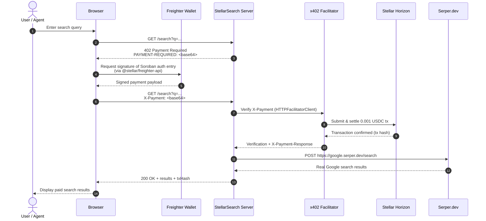

# 🔍 StellarSearch — Pay-Per-Query Web Search for AI Agents

[](https://github.com/Emmy123222/Stellar-Search/actions/workflows/ci.yml)

> **Stellar Hackathon 2026 · Agents on Stellar**
> Zero mock data. Real x402 payments. Real Serper.dev Search. Real Groq AI. Real Freighter wallet.

---

## What it is

StellarSearch is a pay-per-query web search API for autonomous AI agents. Every search costs **0.001 USDC**, settled on Stellar in ~5 seconds using the x402 protocol. No subscriptions, no API keys for the end user — agents pay per request and get real web search results back.

---

## Real stack (no mocks)

| Layer | Real package / service |
|---|---|
| Payment protocol | `@x402/express` + `@x402/stellar` + `@x402/core` (x402 v2 spec) |
| Blockchain | Stellar Testnet (via Horizon API) |
| Facilitator | Coinbase x402 Facilitator (`https://www.x402.org/facilitator`) |
| Wallet connect | `@stellar/freighter-api` (real Freighter extension) |
| Balances / tx | Stellar Horizon REST API (live, not mocked) |
| Search results | Serper.dev API (real Google search results) |
| AI assistant | `groq-sdk` · Llama 3.3 70B (real Groq API) |
| Frontend | React 18, TypeScript, Tailwind CSS, Framer Motion |

---

## Setup

### 1. Clone and install

```bash
git clone <this-repo>
cd stellar-search
npm install
```

### 2. Get your keys (all free)

| Key | Where to get it |
|---|---|
| `STELLAR_RECEIVING_ADDRESS` | [Stellar Lab](https://laboratory.stellar.org/#account-creator?network=test) — generate + fund testnet keypair |
| `SERPER_API_KEY` | [serper.dev](https://serper.dev/) — free tier: 2.5k queries/month |
| `GROQ_API_KEY` | [console.groq.com/keys](https://console.groq.com/keys) — free |

### 3. Configure

```bash
cp .env.example .env
# Fill in the 3 keys above (plus optional variables — see Environment Variables table below)
```

### 4. Install Freighter

Install the [Freighter browser extension](https://freighter.app), create a testnet wallet, and fund it with USDC at [Stellar Lab](https://laboratory.stellar.org).

### 5. Run

```bash
# Terminal 1 — backend
npm run server

# Terminal 2 — frontend
npm run dev
# → http://localhost:5173
```

### 6. Test the x402 flow

```bash
npm run test:search "Stellar blockchain"
```

---

## Environment Variables

All environment variables are read from `.env` (see `.env.example` for a template). Variables prefixed with `VITE_` are exposed to the browser by Vite; all others are server-side only.

| Variable | Required | Default | Description | Example |
|---|---|---|---|---|
| `SERPER_API_KEY` | **Yes** | — | API key for [Serper.dev](https://serper.dev/) web search. Without this, all search, image, and news endpoints return `500`. | `your_serper_api_key_here` |
| `GROQ_API_KEY` | **Yes** | — | API key for [Groq](https://console.groq.com/keys) AI (Llama 3). Without this, the AI assistant and search suggestions fail with an auth error. Server prints `GROQ: ✗ MISSING` on startup. | `gsk_xxxxxxxxxxxxxxxxxxxxxxxx` |
| `STELLAR_RECEIVING_ADDRESS` | **Yes** | — | Stellar public key that receives 0.001 USDC per query. Without this, the x402 payment middleware has no `payTo` address and payments fail. Server prints `Receiving: ✗ MISSING` on startup. | `GDXA3V2LI3VN3GBH5BMOF25QSFJV7S7ZOWMHHQMJRPP4BVORDDRTIIMU` |
| `STELLAR_NETWORK` | No | `stellar:testnet` | Stellar network for the server-side x402 middleware. Accepts `stellar:testnet` or `stellar:mainnet`. Falls back to testnet if missing. | `stellar:testnet` |
| `VITE_STELLAR_NETWORK` | No | `stellar:testnet` | Frontend copy of `STELLAR_NETWORK` (must be prefixed `VITE_` for browser access). Falls back to testnet if missing. | `stellar:testnet` |
| `FACILITATOR_URL` | No | `https://www.x402.org/facilitator` | x402 facilitator endpoint for payment settlement. Defaults to public Coinbase facilitator (no API key needed). | `https://www.x402.org/facilitator` |
| `PORT` | No | `3001` | Express server listen port. Falls back to `3001` if missing. | `3001` |
| `VITE_SERVER_URL` | No | `http://localhost:3001` | Frontend URL for AI chat backend calls. On Vercel deployments auto-detects `${origin}/api`; locally falls back to `http://localhost:3001`. | `http://localhost:3001` |

---

## x402 v2 Header Conventions & Legacy Aliases

StellarSearch uses canonical x402 v2 protocol headers with backward-compatibility support for legacy aliases:

- **Canonical 402 Response Header**: `PAYMENT-REQUIRED` (base64 JSON containing `x402Version: 2`, `resource`, `accepts`).
  - *Legacy Response Alias*: `X-Payment-Required`
- **Canonical Payment Request Header**: `X-Payment` (base64 JSON payload with `x402Version: 2` and signed Soroban auth entry).
  - *Legacy Request Aliases*: `payment-signature`, `x-payment`, `X-PAYMENT`

---

## How the x402 payment flow works

```
Browser (Freighter) → GET /search?q=...
                     ← HTTP 402 + PAYMENT-REQUIRED: <base64 requirements>
                     → Sign Soroban auth entry via @stellar/freighter-api
                     → GET /search + X-Payment: <base64 payment payload>
                     ← Facilitator (x402.org) verifies + settles 0.001 USDC
                     ← 200 OK + Search results
```

1. Agent hits `/search` — the `@x402/express` middleware intercepts
2. Returns `HTTP 402 Payment Required` with `PAYMENT-REQUIRED` header containing price + network + payTo address
3. The x402 client signs a Soroban authorization entry via Freighter wallet (`@stellar/freighter-api`)
4. Retries request with `X-Payment` header containing the signed payment payload
5. Facilitator at `https://www.x402.org/facilitator` verifies signature and settles 0.001 USDC on Stellar testnet
6. Server receives confirmation and returns search results

### Sequence diagram



---

## Project structure

```
stellar-search/
├── src/                        # React frontend
│   ├── hooks/
│   │   ├── useFreighterWallet.ts   # Real Freighter + Horizon integration
│   │   └── useSearch.ts            # Calls real server endpoint
│   ├── components/
│   │   ├── AnimatedBackground.tsx  # Canvas animation
│   │   ├── WalletPanel.tsx         # Real Freighter connect + live balances
│   │   ├── PaymentFlowVisualizer.tsx
│   │   ├── SearchResults.tsx
│   │   ├── StatsGrid.tsx           # Polls real /health endpoint
│   │   └── GroqAssistant.tsx       # Real Groq AI chat
│   ├── pages/
│   │   ├── SearchPage.tsx
│   │   ├── DocsPage.tsx
│   │   └── DashboardPage.tsx       # Live Horizon tx history
│   └── lib/stellar.ts              # Horizon helpers
├── server/
│   └── index.ts                # Express + @x402/express + Serper.dev + Groq
├── mcp-server/
│   └── index.ts                # MCP tools: web_search, ai_summarize, check_balance
├── scripts/
│   └── test-search.ts          # End-to-end test script
├── .env.example
├── claude_mcp.json
└── README.md
```

---

## Claude Code / MCP integration

```json
// claude_mcp.json
{
  "mcpServers": {
    "stellar-search": {
      "command": "npx",
      "args": ["tsx", "./mcp-server/index.ts"],
      "env": {
        "GROQ_API_KEY": "your_groq_api_key",
        "SEARCH_API_URL": "http://localhost:3001"
      }
    }
  }
}
```

Then tell Claude Code: `"Search for the latest Stellar x402 examples"` — it calls `web_search`, the server pays via x402, and Claude gets real results.

---

## Hackathon requirements

| Requirement | ✓ |
|---|---|
| Open-source repo + README | ✅ |
| 2–3 min video demo | Record showing: connect Freighter → search → see 402 → payment settles → results |
| Real Stellar testnet transactions | ✅ Every search settles 0.001 USDC via OpenZeppelin facilitator |
| x402 protocol | ✅ `@x402/express` + `@x402/stellar` |
| Addresses explicit demand signal | ✅ "pay-per-query web search instead of monthly subscriptions" |
