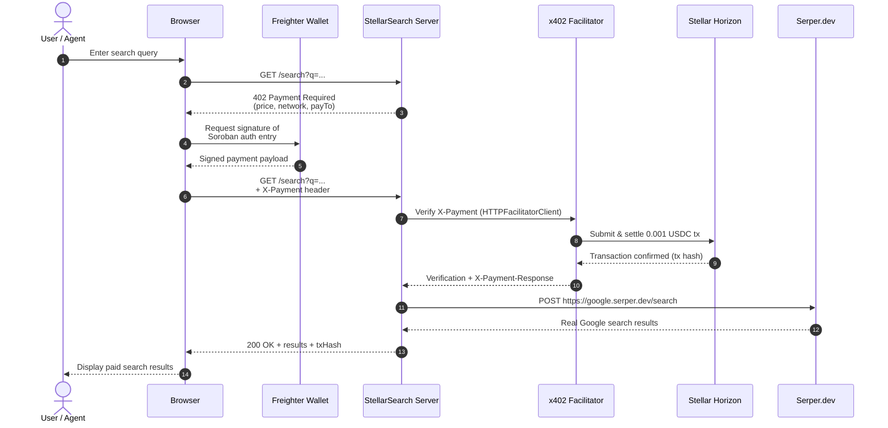

# 🔍 StellarSearch — Pay-Per-Query Web Search for AI Agents

[](https://github.com/Emmy123222/Stellar-Search/actions/workflows/ci.yml)

> **Stellar Hackathon 2026 · Agents on Stellar**
> Zero mock data. Real x402 payments. Real Serper.dev Search. Real Groq AI. Real Freighter wallet.

---

## What it is

StellarSearch is a pay-per-query web search API for autonomous AI agents. Every search costs **0.001 USDC**, settled on Stellar in ~5 seconds using the x402 protocol. No subscriptions, no API keys for the end user — agents pay per request and get real web search results back.

---

## Real stack (no mocks)

| Layer | Real package / service |
|---|---|
| Payment protocol | `@x402/express` + `@x402/stellar` + `@x402/core` |
| Blockchain | Stellar Testnet (via Horizon API) |
| Facilitator | OpenZeppelin x402 (`channels.openzeppelin.com`) |
| Wallet connect | `@stellar/freighter-api` (real Freighter extension) |
| Balances / tx | Stellar Horizon REST API (live, not mocked) |
| Search results | Serper.dev API (real Google search results) |
| AI assistant | `groq-sdk` · Llama 3.3 70B (real Groq API) |
| Frontend | React 18, TypeScript, Tailwind CSS, Framer Motion |

---

## Setup

### 1. Clone and install

```bash
git clone <this-repo>
cd stellar-search
npm install
```

### 2. Get your keys (all free)

| Key | Where to get it |
|---|---|
| `STELLAR_RECEIVING_ADDRESS` | [Stellar Lab](https://laboratory.stellar.org/#account-creator?network=test) — generate + fund testnet keypair |
| `SERPER_API_KEY` | [serper.dev](https://serper.dev/) — free tier: 2.5k queries/month |
| `GROQ_API_KEY` | [console.groq.com/keys](https://console.groq.com/keys) — free |

### 3. Configure

```bash
cp .env.example .env
# Fill in the 3 keys above (plus optional variables — see Environment Variables table below)
```

### 4. Install Freighter

Install the [Freighter browser extension](https://freighter.app), create a testnet wallet, and fund it with USDC at [Stellar Lab](https://laboratory.stellar.org).

### 5. Run

```bash
# Terminal 1 — backend
npm run server

# Terminal 2 — frontend
npm run dev
# → http://localhost:5173
```

### 6. Test the x402 flow

```bash
npm run test:search "Stellar blockchain"
```

---

## Environment Variables

All environment variables are read from `.env` (see `.env.example` for a template). Variables prefixed with `VITE_` are exposed to the browser by Vite; all others are server-side only.

| Variable | Required | Default | Description | Example |
|---|---|---|---|---|
| `SERPER_API_KEY` | **Yes** | — | API key for [Serper.dev](https://serper.dev/) web search. Without this, all search, image, and news endpoints return `500`. | `your_serper_api_key_here` |
| `GROQ_API_KEY` | **Yes** | — | API key for [Groq](https://console.groq.com/keys) AI (Llama 3). Without this, the AI assistant and search suggestions fail with an auth error. Server prints `GROQ: ✗ MISSING` on startup. | `gsk_xxxxxxxxxxxxxxxxxxxxxxxx` |
| `STELLAR_RECEIVING_ADDRESS` | **Yes** | — | Stellar public key that receives 0.001 USDC per query. Without this, the x402 payment middleware has no `payTo` address and payments fail. Server prints `Receiving: ✗ MISSING` on startup. | `GDXA3V2LI3VN3GBH5BMOF25QSFJV7S7ZOWMHHQMJRPP4BVORDDRTIIMU` |
| `STELLAR_NETWORK` | No | `stellar:testnet` | Stellar network for the server-side x402 middleware. Accepts `stellar:testnet` or `stellar:mainnet`. Falls back to testnet if missing. | `stellar:testnet` |
| `VITE_STELLAR_NETWORK` | No | `stellar:testnet` | Frontend copy of `STELLAR_NETWORK` (must be prefixed `VITE_` for browser access). Falls back to testnet if missing. | `stellar:testnet` |
| `FACILITATOR_URL` | No | `https://www.x402.org/facilitator` | x402 facilitator endpoint for payment settlement. Falls back to the public OpenZeppelin facilitator if missing. | `https://www.x402.org/facilitator` |
| `PORT` | No | `3001` | Express server listen port. Falls back to `3001` if missing. | `3001` |
| `VITE_SERVER_URL` | No | `http://localhost:3001` | Frontend URL for AI chat backend calls. On Vercel deployments auto-detects `${origin}/api`; locally falls back to `http://localhost:3001`. | `http://localhost:3001` |

---

## How the x402 payment flow works

```
Browser (Freighter) → GET /search?q=...
                     ← HTTP 402 + payment requirements
                     → Sign Soroban auth entry (Freighter prompt)
                     → GET /search + X-Payment: <signature>
                     ← OpenZeppelin facilitator verifies + settles 0.001 USDC
                     ← 200 OK + Search results
```

1. Agent hits `/search` — the `@x402/express` middleware intercepts
2. Returns `HTTP 402 Payment Required` with price + network + payTo address
3. The x402 client signs a Soroban authorization entry via Freighter wallet
4. Retries with `X-Payment` header containing the signed entry
5. OpenZeppelin facilitator at `channels.openzeppelin.com/x402/testnet` verifies the signature and settles 0.001 USDC on Stellar testnet
6. Server receives confirmation and returns search results

### Sequence diagram



---

## Observability & reliability

StellarSearch keeps Express, Vercel, browser, and MCP aligned and preserves verified x402 settlement for paid routes.

### Health, readiness, and metrics

- `GET /health` (Express) and `GET /api/health` (Vercel) return **cached, low-cost readiness** checks with strict **2000 ms** timeouts and a **30 s** TTL. Each dependency reports `configured` (env present), `reachable` (network), and `status: ok | degraded | unavailable | not_configured`.
  - `serper` — HEAD reachability (or `HEALTH_CHECK_SERPER_DEEP=true` for a `num:1` probe that validates credentials; off by default to avoid billing).
  - `groq` — `GET https://api.groq.com/openai/v1/models` validates key and reachability without spending tokens.
  - `facilitator` / `horizon` — GET probe with timeout.
  - Overall `status: ok` when all reachable; `degraded` when any `degraded`/`not_configured` or single `unavailable`; `unavailable` when ≥2 unavailable. Cached flag `readiness.cached` + `cacheAgeMs` is exposed.
- `GET /ready` is an alias for readiness (useful for k8s / Vercel checks).
- `GET /metrics` (Express) exposes **bounded percentiles** without unbounded arrays — per-phase circular buffers (500 samples) via `server/metrics.ts`:
  ```json
  {
    "latency": { "avgMs": 42, "p50Ms": 38, "p95Ms": 120, "p99Ms": 210, "samples": 12 },
    "timings": {
      "total": { "count": 12, "avgMs": 42, "p50Ms": 38, "p95Ms": 120, "p99Ms": 210 }
    },
    "checks": { "serper": { "status": "ok" }, "groq": { "status": "unavailable" } }
  }
  ```
  `totalQueries` / `totalUsdcSettled` and legacy `avgLatencyMs` are preserved for compatibility.

### Phase timings (shared vocabulary)

Every request records **per-phase `durationMs` + `outcome`** with a single vocabulary (`src/lib/timing.ts` → `server/metrics.ts` → `src/hooks/useSearch.ts` → `mcp-server`):

`validation` → `serper` → `groq_suggestions` (optional, `groq`/`ai_chat`) → `total`; browser/MCP also record `wallet_sign` / `browser_fetch` / `x402`. Server responses include `timings: { validationMs, serperMs, totalMs }`; browser `useSearch` merges `server_*` timings into `session.timings` for end-to-end explanation. Health/Metrics surface `p50/p95/p99` from the bounded buffers.

### Redactor (privacy)

`src/lib/redactor.ts` + `server/logger.ts` + `mcp-server` use a **recursive, case-insensitive** redactor covering headers (`Authorization`, `X-Payment`, `payment-signature`, `X-API-KEY`), keys (`SERPER_API_KEY`, `GROQ_API_KEY`, `token`), addresses (`walletAddress`, `receivingAddress`, `payTo`), and query/content fields (`q`, `query`, `text`, `content`, `messages`, `prompt`). Nested objects/arrays and standalone sensitive values (Stellar `G…` 56-char, `gsk_…`, `Bearer …`) are replaced with `[REDACTED]`. Tests prove nested and case-variant coverage.

### Smoke — scheduled deployment guard

`.github/workflows/smoke.yml` runs **scheduled** (03:17 UTC daily), on push/PR, and on manual dispatch:

- Starts the Express server locally with dummy keys and runs `scripts/verify-deployment.ts` (`npm run test:smoke`) — validates `GET /`, `GET /health` (status + checks + latency), `GET /ready`, `GET /metrics` (no unbounded arrays), **no-charge `402` challenge** (`PAYMENT-REQUIRED` asset is Soroban `C…`, `amount: 10000`, `payTo` set, CORS `Access-Control-Expose-Headers` includes `PAYMENT-REQUIRED`), `OPTIONS` CORS preflight, and `POST /ai/chat` negotiation.
- When `vars.SMOKE_BASE_URL` / `secrets.SMOKE_BASE_URL` or `inputs.base_url` is set, repeats the same checks against the deployed URL (Vercel `…/api` aware).
- **Optional funded settlement** — when `SMOKE_FUND_WALLET=1` (workflow input `funded: true` or `vars.SMOKE_FUND_ENABLED=true`) uses capped credentials (`SMOKE_MAX_USDC` default `0.001`, hard cap `0.01`) and verifies facilitator/horizon reachability. Whether funded or not, the job publishes **actionable artifacts** (`smoke-report.json` + `smoke-report.md` + server log) via `actions/upload-artifact`.

Run locally:

```bash
npm run test:smoke                 # hits http://localhost:3001 — start server first
BASE_URL=https://your-app.vercel.app/api npm run test:smoke
SMOKE_FUND_WALLET=1 SMOKE_MAX_USDC=0.001 npm run test:smoke  # capped funded path
```

### Environment additions

| Variable | Purpose |
|---|---|
| `HEALTH_CHECK_SERPER_DEEP` | `true` → validate Serper key with a `num:1` probe (costs 1 query per TTL); default `false` (cheap HEAD). |
| `SMOKE_BASE_URL` | Repository Variable/Secret for deployed smoke target. |
| `SMOKE_FUND_WALLET` / `SMOKE_MAX_USDC` | Opt-in funded smoke cap (workflow only). |

---

## Project structure

```
stellar-search/
├── src/                        # React frontend
│   ├── hooks/
│   │   ├── useFreighterWallet.ts   # Real Freighter + Horizon integration
│   │   └── useSearch.ts            # Calls real server endpoint
│   ├── components/
│   │   ├── AnimatedBackground.tsx  # Canvas animation
│   │   ├── WalletPanel.tsx         # Real Freighter connect + live balances
│   │   ├── PaymentFlowVisualizer.tsx
│   │   ├── SearchResults.tsx
│   │   ├── StatsGrid.tsx           # Polls real /health endpoint
│   │   └── GroqAssistant.tsx       # Real Groq AI chat
│   ├── pages/
│   │   ├── SearchPage.tsx
│   │   ├── DocsPage.tsx
│   │   └── DashboardPage.tsx       # Live Horizon tx history
│   └── lib/stellar.ts              # Horizon helpers
├── server/
│   ├── index.ts                # Express + @x402/express + Serper.dev + Groq + timing/metrics/readiness
│   ├── readiness.ts            # Cached low-cost checks (2000ms timeouts, 30s TTL)
│   ├── metrics.ts              # Bounded circular buffers, p50/p95/p99 exposure
│   ├── logger.ts               # Winston + recursive redactor
│   └── corsConfig.ts
├── mcp-server/
│   └── index.ts                # MCP tools: web_search, ai_summarize, check_balance (redacted + timing)
├── api/
│   ├── health.ts               # Vercel health (mirrors server readiness)
│   ├── search.ts               # Vercel x402 (preserves settlement semantics, CORS)
│   └── ai/chat.ts
├── scripts/
│   ├── test-search.ts          # End-to-end x402 test
│   └── verify-deployment.ts    # Smoke: root/health/402/CORS/AI + capped funded artifacts
├── src/lib/
│   ├── redactor.ts             # Shared recursive redactor (headers/keys/addresses/query)
│   ├── timing.ts               # Shared timing vocabulary
│   └── stellar.ts
├── .github/workflows/
│   ├── ci.yml
│   └── smoke.yml               # Scheduled smoke (local + deployed + optional funded)
├── .env.example
├── claude_mcp.json
└── README.md
```

---

## Claude Code / MCP integration

```json
// claude_mcp.json
{
  "mcpServers": {
    "stellar-search": {
      "command": "npx",
      "args": ["tsx", "./mcp-server/index.ts"],
      "env": {
        "GROQ_API_KEY": "your_groq_api_key",
        "SEARCH_API_URL": "http://localhost:3001"
      }
    }
  }
}
```

Then tell Claude Code: `"Search for the latest Stellar x402 examples"` — it calls `web_search`, the server pays via x402, and Claude gets real results.

---

## Hackathon requirements

| Requirement | ✓ |
|---|---|
| Open-source repo + README | ✅ |
| 2–3 min video demo | Record showing: connect Freighter → search → see 402 → payment settles → results |
| Real Stellar testnet transactions | ✅ Every search settles 0.001 USDC via OpenZeppelin facilitator |
| x402 protocol | ✅ `@x402/express` + `@x402/stellar` |
| Addresses explicit demand signal | ✅ "pay-per-query web search instead of monthly subscriptions" |
