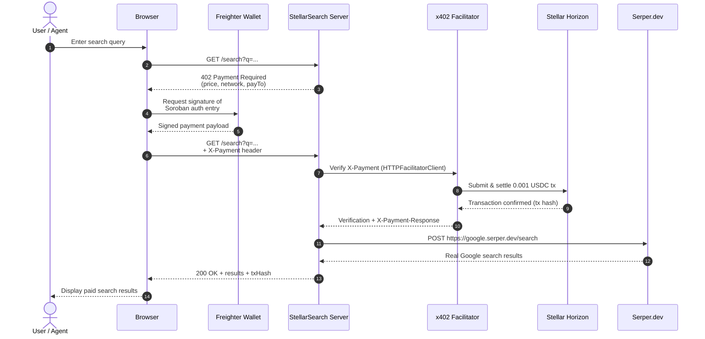

# 🔍 StellarSearch — Pay-Per-Query Web Search for AI Agents

[](https://github.com/Emmy123222/Stellar-Search/actions/workflows/ci.yml)

> **Stellar Hackathon 2026 · Agents on Stellar**
> Zero mock data. Real x402 payments. Real Serper.dev Search. Real Groq AI. Real Freighter wallet.

---

## What it is

StellarSearch is a pay-per-query web search API for autonomous AI agents. Every search costs **0.001 USDC**, settled on Stellar in ~5 seconds using the x402 protocol. No subscriptions, no API keys for the end user — agents pay per request and get real web search results back.

---

## Real stack (no mocks)

| Layer | Real package / service |
|---|---|
| Payment protocol | `@x402/express` + `@x402/stellar` + `@x402/core` |
| Blockchain | Stellar Testnet (via Horizon API) |
| Facilitator | OpenZeppelin x402 (`channels.openzeppelin.com`) |
| Wallet connect | `@stellar/freighter-api` (real Freighter extension) |
| Balances / tx | Stellar Horizon REST API (live, not mocked) |
| Search results | Serper.dev API (real Google search results) |
| AI assistant | `groq-sdk` · Llama 3.3 70B (real Groq API) |
| Frontend | React 18, TypeScript, Tailwind CSS, Framer Motion |

---

## Setup

### 1. Clone and install

```bash
git clone <this-repo>
cd stellar-search
npm install
```

### 2. Get your keys (all free)

| Key | Where to get it |
|---|---|
| `STELLAR_RECEIVING_ADDRESS` | [Stellar Lab](https://laboratory.stellar.org/#account-creator?network=test) — generate + fund testnet keypair |
| `SERPER_API_KEY` | [serper.dev](https://serper.dev/) — free tier: 2.5k queries/month |
| `GROQ_API_KEY` | [console.groq.com/keys](https://console.groq.com/keys) — free |

### 3. Configure

```bash
cp .env.example .env
# Fill in the 3 keys above (plus optional variables — see Environment Variables table below)
```

### 4. Install Freighter

Install the [Freighter browser extension](https://freighter.app), create a testnet wallet, and fund it with USDC at [Stellar Lab](https://laboratory.stellar.org).

### 5. Run

```bash
# Terminal 1 — backend
npm run server

# Terminal 2 — frontend
npm run dev
# → http://localhost:5173
```

### 6. Test the x402 flow

```bash
# Discovery mode: health + runtime checks
npm run search:cli -- "Stellar x402" --mode discovery --json

# Quote mode: fetch the x402 quote without settling payment
npm run search:cli -- "Stellar x402" --mode quote --json --receipt ./tmp/quote.json

# Search mode: run the paid flow with a timeout and optional freshness filter
npm run search:cli -- "Stellar x402" --mode search --count 5 --timeout 30000 --freshness pw
```

The CLI supports `discovery`, `quote`, and `search` modes, emits machine-readable JSON when `--json` is used, and can write a receipt file with `--receipt path/to/file.json`. For paid actions, prefer secure environment variables or a protected prompt for signing material; never pass private keys on the command line or print them in logs.

---

## Environment Variables

All environment variables are read from a local `.env` (see the sanitized `.env.example` template). Variables prefixed with `VITE_` are exposed to the browser by Vite; all others are server-side only. Startup validates configuration before Express, Vercel paid routes, or MCP tools begin serving requests. Errors list only variable **names**, never values.

| Variable | Required | Default | Description | Example |
|---|---|---|---|---|
| `SERPER_API_KEY` | **Yes** | — | API key for [Serper.dev](https://serper.dev/) web search. Without this, all search, image, and news endpoints return `500`. | `your_serper_api_key_here` |
| `GROQ_API_KEY` | No | — | API key for [Groq](https://console.groq.com/keys) AI (Llama 3). When absent, search remains available and AI endpoints return `503`. | `gsk_xxxxxxxxxxxxxxxxxxxxxxxx` |
| `STELLAR_RECEIVING_ADDRESS` | **Yes** | — | Stellar public key that receives 0.001 USDC per query. Without this, the x402 payment middleware has no `payTo` address and payments fail. Server prints `Receiving: ✗ MISSING` on startup. | `GDXA3V2LI3VN3GBH5BMOF25QSFJV7S7ZOWMHHQMJRPP4BVORDDRTIIMU` |
| `STELLAR_NETWORK` | No | `stellar:testnet` | Stellar network for the server-side x402 middleware. Accepts `stellar:testnet` or `stellar:mainnet`. Falls back to testnet if missing. | `stellar:testnet` |
| `VITE_STELLAR_NETWORK` | No | `stellar:testnet` | Frontend copy of `STELLAR_NETWORK` (must be prefixed `VITE_` for browser access). Falls back to testnet if missing. | `stellar:testnet` |
| `FACILITATOR_URL` | No | `https://www.x402.org/facilitator` | x402 facilitator endpoint for payment settlement. Falls back to the public OpenZeppelin facilitator if missing. | `https://www.x402.org/facilitator` |
| `PORT` | No | `3001` | Express server listen port. Falls back to `3001` if missing. | `3001` |
| `RATE_LIMIT_PER_MINUTE` | No | `30` | Positive request limit applied by Express. | `30` |
| `PAYMENT_AMOUNT_USDC` | No | `0.001` | Positive USDC amount. Must exactly equal `PAYMENT_AMOUNT_STROOPS / 10^7`. | `0.001` |
| `PAYMENT_AMOUNT_STROOPS` | No | `10000` | Positive Stellar stroop amount paired with `PAYMENT_AMOUNT_USDC`. | `10000` |
| `VITE_SERVER_URL` | No | `/api` | Browser-safe API base URL. Defaults to same-origin `/api`, which works for custom domains and subpaths; Vite proxies it to Express locally. | `/api` or `https://api.example.com/stellar` |

### Deployment configuration

Use your platform's encrypted secret configuration (for example, Vercel Project Settings → Environment Variables) for `STELLAR_RECEIVING_ADDRESS` and `SERPER_API_KEY`; do not commit production `.env` files. `.env.production`, `.env`, and local override files are ignored. Only `.env.example` is tracked and it contains placeholders only.

Before deploying locally, run:

```bash
npm run config:check
```

The typed schema checks required core variables separately from optional feature variables, plus Stellar network enums, public-key addresses, HTTP(S) URLs, ports, rate limits, and the USDC/stroop amount relationship. The browser receives only `VITE_STELLAR_NETWORK` and `VITE_SERVER_URL`; secrets never enter the browser configuration view.
| `VITE_SERVER_URL` | No | `http://localhost:3001` | Frontend URL for AI chat backend calls. On Vercel deployments auto-detects `${origin}/api`; locally falls back to `http://localhost:3001`. | `http://localhost:3001` |
| `MCP_ENABLE_RECEIPTS` | No | `0` | Set `1` to opt-in MCP local receipt storage for `stellar-search://receipts/recent` (in-memory capped at 50) | `1` |
| `RECONCILIATION_LOG_PATH` | No | `logs/reconciliation.jsonl` | Path to the append-only settlement reconciliation log (see [Settlement reconciliation](#settlement-reconciliation)). | `/var/log/stellarsearch/reconciliation.jsonl` |

---

## How the x402 payment flow works

```
Browser (Freighter) → GET /search?q=...
                     ← HTTP 402 + payment requirements
                     → Sign Soroban auth entry (Freighter prompt)
                     → GET /search + X-Payment: <signature>
                     ← OpenZeppelin facilitator verifies + settles 0.001 USDC
                     ← 200 OK + Search results
```

1. Agent hits `/search` — the `@x402/express` middleware intercepts
2. Returns `HTTP 402 Payment Required` with price + network + payTo address
3. The x402 client signs a Soroban authorization entry via Freighter wallet
4. Retries with `X-Payment` header containing the signed entry
5. OpenZeppelin facilitator at `channels.openzeppelin.com/x402/testnet` verifies the signature and settles 0.001 USDC on Stellar testnet
6. Server enforces payment integrity (`src/lib/paymentIntegrity.ts`), rejecting replayed or duplicate payloads within the 300-second validity window, and returns search results

### Payment Integrity & Replay Protection

To guarantee that each payment identifier authorizes **exactly one provider call**, StellarSearch tracks consumed payment identifiers across Express (`server/index.ts`) and Vercel (`api/search.ts`) runtimes:
- **Payload Invalidation:** Extracts transaction hashes (or SHA-256 fallback hashes of payment headers) and invalidates consumed payloads for a 300-second window.
- **Concurrency Throttling:** Rapid parallel requests using identical payment payloads are throttled so only one search query proceeds; concurrent duplicates immediately receive HTTP 402 (`Payment payload already consumed`).

### Client-side duplicate submission guard

The server-side throttling above assumes a request actually reaches it — but
`useSearch` (`src/hooks/useSearch.ts`) can itself be asked to start a second
paid flow before the first has settled, e.g. a double Enter/double click that
fires before React re-renders `isSearching`, or a second browser tab open on
the same page. To prevent that from producing two Freighter payment prompts
(and two settlements) for one logical query:

- **Same-tab guard:** a `useRef` flips synchronously on the first call and
  blocks re-entrant calls for the lifetime of that in-flight search,
  independent of React's (batched, async) `session.status` state.
- **Cross-tab mutex:** a `localStorage`-backed lock (`stellarsearch_search_lock`)
  is acquired before the 402 probe is even sent. A second tab attempting to
  search while the lock is held gets a toast ("Search already in progress")
  instead of starting its own payment flow. The lock carries a 20s TTL so a
  crashed/closed tab can never permanently block searching in other tabs.

Both guards release in a `finally` block regardless of success or failure, so
a completed or failed search always unblocks the next one.

### Sequence diagram



### Settlement reconciliation

Every paid `/search`, `/images`, and `/news` request writes a
`ReconciliationRecord` (`src/lib/reconciliation.ts`) to an append-only JSON
Lines log (`server/reconciliationStore.ts`, default `logs/reconciliation.jsonl`,
configurable via `RECONCILIATION_LOG_PATH`). Each record links the request's
idempotency key (the payment identifier from `src/lib/paymentIntegrity.ts`),
its settlement receipt (tx hash), and whether a provider response was
delivered — **never the query text itself** — so operators can catch two
kinds of drift:

- `settled_no_delivery` — payment was consumed but no search response was
  delivered (upstream Serper error, a validation failure after the payment
  gate, etc.)
- `delivered_no_settlement` — a response was returned without a captured
  payment identifier (shouldn't happen given the x402 gate; catches
  regressions)

Run the repeatable reconciliation job to report unmatched or inconsistent
records (exits non-zero when any are found, so it can run on a schedule):

```bash
npm run reconcile:report
```

---

## Project structure

```
stellar-search/
├── src/                        # React frontend
│   ├── hooks/
│   │   ├── useFreighterWallet.ts   # Real Freighter + Horizon integration
│   │   └── useSearch.ts            # Calls real server endpoint
│   ├── components/
│   │   ├── AnimatedBackground.tsx  # Canvas animation
│   │   ├── WalletPanel.tsx         # Real Freighter connect + live balances
│   │   ├── PaymentFlowVisualizer.tsx
│   │   ├── SearchResults.tsx
│   │   ├── StatsGrid.tsx           # Polls real /health endpoint
│   │   └── GroqAssistant.tsx       # Real Groq AI chat
│   ├── pages/
│   │   ├── SearchPage.tsx
│   │   ├── DocsPage.tsx
│   │   └── DashboardPage.tsx       # Live Horizon tx history
│   └── lib/stellar.ts              # Horizon helpers
├── server/
│   └── index.ts                # Express + @x402/express + Serper.dev + Groq + batch/jsonl + jobs/webhooks
├── api/
│   ├── search.ts               # Vercel parity for GET /search
│   ├── search/batch.ts         # Vercel parity for POST /search/batch (JSONL)
│   ├── jobs.ts                 # POST /jobs (+ GET /jobs list)
│   ├── jobs/[id].ts            # GET /jobs/:id status + verified payment
│   ├── ai/chat.ts              # Vercel AI chat (streaming)
│   └── health.ts               # Vercel health
├── mcp-server/
│   └── index.ts                # MCP tools + resources + prompts + progress
├── scripts/
│   └── test-search.ts          # End-to-end test script
├── .env.example
├── claude_mcp.json
└── README.md
```

---

## Internationalization (#345)

English is the complete, always-available fallback locale, via [i18next](https://www.i18next.com) + `react-i18next`. Setup lives in `src/i18n/`:

- **Namespaces**, one JSON file per feature area under `src/i18n/locales/en/`: `common` (nav/footer), `wallet`, `search`, `onboarding`, `errors`, `docs`.
- **Eager vs. lazy**: `common` is bundled at build time; `wallet`/`search`/`onboarding`/`errors` are loaded once at boot (`main.tsx`) since they're needed for the always-visible chrome. `docs` is genuinely lazy — `loadNamespace('docs')` is only called when `DocsPage` mounts, so its translations ship in their own chunk rather than the main bundle.
- **Pluralization**: standard i18next `_one`/`_other` key suffixes, e.g. `wallet:queriesRemaining`.
- **Interpolation**: e.g. `common:footer.links.explorer` (`"{{network}} Explorer"`), and payment-unit amounts like `onboarding:steps.payment.description` (`"...settles {{amount}} USDC..."`).
- **Adding a namespace**: add it to `SUPPORTED_NAMESPACES` in `src/i18n/index.ts`, add `src/i18n/locales/en/<name>.json`, then either add it to `main.tsx`'s eager-load list or call `loadNamespace('<name>')` from whichever component needs it.

**Scope note**: this introduces the framework and converts a representative slice of the app's copy (nav, footer, wallet panel, onboarding, part of search, error messages from the wallet hook) — not literally every string in every component. `DocsPage`'s body copy and the rest of `SearchPage` remain hardcoded English for now; the pattern above is what to follow to convert them. Tests: `src/i18n/index.test.ts`.

## First-run onboarding (#342)

`src/components/onboarding/OnboardingFlow.tsx` walks a new user through the three things a paid search needs — connect Freighter, establish a USDC trustline, fund it — auto-opening once per browser (`localStorage`, key `stellar-search:onboarding-dismissed`) unless already dismissed or already fully set up, and reopenable anytime via the "?" button in the navbar.

- **Detection** (`src/lib/onboarding.ts`) is derived entirely from wallet state `useFreighterWallet` already exposes (`connected`, the new `hasUsdcTrustline` flag, `usdcBalance`) — nothing here reads or stores a secret key.
- **Testnet vs. mainnet** are visually distinguished in the modal (a banner plus separate funding links — Stellar Laboratory's testnet account creator vs. Circle for real USDC), reusing the same `IS_MAINNET` split `WalletPanel` already used for its own funding link.
- No new transaction-signing code was added — trustline setup and funding are point-and-click via Freighter/external tools, so the existing x402 payment/signing path (`useSearch`) is untouched. Tests: `src/lib/onboarding.test.ts`.

---

## Claude Code / MCP integration

```json
// claude_mcp.json
{
  "mcpServers": {
    "stellar-search": {
      "command": "npx",
      "args": ["tsx", "./mcp-server/index.ts"],
      "env": {
        "GROQ_API_KEY": "your_groq_api_key",
        "SEARCH_API_URL": "http://localhost:3001"
      }
    }
  }
}
```

Then tell Claude Code: `"Search for the latest Stellar x402 examples"` — it calls `web_search`, the server pays via x402, and Claude gets real results.

### MCP progress notifications (#327)

Paid MCP tools (`web_search`, `image_search`, `news_search`) emit **bounded** `notifications/progress` events for actual payment/search phases **only when the client sends `_meta.progressToken`**:

| progress | total | phase | message |
|---:|---:|---|---|
| 1 | 4 | challenge | Requesting payment challenge |
| 2 | 4 | signing | Signing Soroban auth |
| 3 | 4 | settlement | Settling 0.001 USDC on Stellar |
| 4 | 4 | search | Searching Serper |

Cancellation (`notifications/cancelled`) and errors terminate progress cleanly **without false completion** — the tool returns `isError: true` and no additional progress after abort. Progress is never sent without a `progressToken`; free tools never emit progress.

### MCP resources & prompts (#326)

Resources (no payment required):

- `stellar-search://capabilities` — network, price, x402 scheme, endpoint map
- `stellar-search://schema/search` — JSON schema for `SearchResponse`, batch JSONL events, and job contracts
- `stellar-search://receipts/recent` — recent paid receipts **only when opted-in** (`MCP_ENABLE_RECEIPTS=1`, capped at 50, in-memory, no secrets). Otherwise returns guidance to opt-in.

Prompts (no silent payment):

- `research_brief` — proposes 3–5 queries, **asks for explicit user approval** before calling any paid `web_search`, then synthesizes via `ai_summarize`
- `summarize_results` — free Groq summarization of pasted results
- `compare_sources` — free comparison with citations

Prompts never call paid tools themselves; the agent must obtain user approval before initiating `x402` settlement. This preserves explicit user approval and verified settlement for paid actions.

### Batch JSON Lines streaming (#325)

```
POST /search/batch  (Express: POST /search/batch, Vercel: POST /api/search/batch)
Content-Type: application/json  →  Response: application/x-ndjson (versioned JSONL)
```

Bounded to **10 queries** and **0.01 USDC aggregate** (10 × 0.001). Idempotency via `Idempotency-Key` header or `body.idempotencyKey` (24 h). Events are `v:1` versioned:

- `quote` — price preview (also returned as 402 `PAYMENT-REQUIRED` when no `X-Payment` header)
- `settlement` — verified `paymentId`/`txHash` after `consumePaymentPayload`
- `result` — per-query normalized results (one line per query, machine-readable)
- `error` — per-item failures without aborting the batch (`UPSTREAM_ERROR`, `SEARCH_FAILED`, `CLIENT_DISCONNECT`, `SKIPPED`)
- `done` — aggregate `succeeded`/`failed`/`totalUsdcSpent`/`aggregateLatencyMs`

Disconnect aborts the in-flight Serper fetch via `AbortController`, emits `CLIENT_DISCONNECT`/`SKIPPED` errors for remaining items, and ends without a false `done` `succeeded` count. Partial completion is explicit in `done`. Example:

```bash
curl -N -X POST http://localhost:3001/search/batch \
  -H "Content-Type: application/json" \
  -H "X-Payment: <base64-signed-auth>" \
  -H "Idempotency-Key: my-batch-123" \
  -d '{"queries":["stellar x402","serper.dev"],"count":5}'
# each line is JSON: {"v":1,"type":"result",...}
```

### Async paid search jobs with webhooks (#324)

```
POST /jobs  → 202 { jobId, statusUrl, paymentVerified, paymentId, txHash }
GET  /jobs/:id → { job, paymentVerified, statusUrl }
GET  /jobs     → { jobs, count }
```

- Idempotent creation via `Idempotency-Key` (24 h, returns existing `jobId`/`statusUrl` on replay).
- Payment verified via `x402` header + `consumePaymentPayload` replay protection; `GET /jobs/:id` exposes verified payment state (`paymentVerified`, `txHash`, `paidAmount`).
- Optional webhook: `{ webhookUrl, webhookSecret }` — `webhookSecret` ≥16 chars. Delivery is **signed** (`X-Webhook-Signature: HMAC-SHA256(timestamp.payload)`, `X-Webhook-Timestamp`, `X-Webhook-Attempt`, `X-Job-Id`) and **retries with backoff** (5 attempts, `1s·2^n` + jitter, 5 s timeout, non-retryable 4xx except 429). Protects against replay via `timestamp` (5 min window) + `nonce`, and **SSRF** by rejecting `http`, private IPs (`10/8`, `192.168/16`, `172.16/12`, `169.254/16`, `fc00::/7`, `fe80::/10`, `localhost`, `127.0.0.1`, `0.0.0.0`, `::1`) and URLs with credentials.

```bash
curl -X POST http://localhost:3001/jobs \
  -H "Content-Type: application/json" \
  -H "X-Payment: <base64>" \
  -H "Idempotency-Key: job-123" \
  -d '{"query":"stellar x402","webhookUrl":"https://example.com/hook","webhookSecret":"s3cr3t-16-chars-min"}'
# → {"jobId":"...","statusUrl":"http://localhost:3001/jobs/...","paymentVerified":true}
curl http://localhost:3001/jobs/<jobId>
```

Webhook verification (receiver):

```js
import crypto from 'crypto'
function verify(payload, signature, secret, tsHeader) {
  const expected = crypto.createHmac('sha256', secret).update(`${tsHeader}.${payload}`).digest('hex')
  return crypto.timingSafeEqual(Buffer.from(expected), Buffer.from(signature)) && Date.now() - parseInt(tsHeader) < 5*60*1000
}
```

Express/Vercel/browser/MCP contracts stay aligned: `STELLAR_NETWORK`, `USDC_CONTRACT`, `AMOUNT_STROOPS=10000` (0.001 USDC), and verified settlement remain the single source of truth (`src/lib/constants`).

### Spelling-Correction Metadata & User Confirmation (#302)

When upstream search providers auto-correct or suggest queries ("Did you mean?"), callers and users can distinguish the query variations:

- `originalQuery` — user/caller input query
- `executedQuery` — actual query executed against the upstream search engine
- `suggestedQuery` — spelling suggestion / "Did you mean" query text
- `isCorrected` — boolean (`true` if `executedQuery` differs from `originalQuery`)
- `query` — preserved for backwards compatibility (maps to executed query)

**User Confirmation Mechanics:**
- **Auto-Correction**: Displays an informative banner explaining that results were auto-corrected, with a one-click option to search the original query with explicit wallet confirmation.
- **Did You Mean Suggestions**: Displays the suggested correction alongside "Search Suggestion" (which invokes the explicit Freighter confirmation flow) and a "Dismiss" action that closes the suggestion with **0 additional cost and no second payment**.
- No automatic or silent payments are ever executed.

---

## Testing & Coverage

Coverage is enforced via **Vitest + @vitest/coverage-v8** with thresholds for **statements, branches, functions, and lines** (see `vite.config.ts:6`).

```bash
npm run test              # unit tests without coverage
npm run test:coverage     # run with coverage + thresholds (CI gate)
```

Reports are generated to `coverage/` (`text`, `json`, `html`, `lcov`). CI uploads the `coverage/` artifact and fails if thresholds are not met.

### Current thresholds (ratchet upward)

Global thresholds are deliberately modest initially and ratchet upward as payment/wallet/API/MCP/UI tests land:

| Scope | Statements | Branches | Functions | Lines |
|---|---:|---:|---:|---:|
| **Global** | 40% | 35% | 30% | 40% |
| `src/lib/constants.ts` | 90% | 60% | 100% | 90% |
| `src/lib/stellar.ts` | 85% | 75% | 85% | 85% |
| `src/lib/paymentIntegrity.ts` | 90% | 85% | 95% | 90% |
| `src/lib/serperNormalizer.ts` | 95% | 90% | 100% | 95% |
| `server/corsConfig.ts` | 90% | 85% | 95% | 90% |
| `src/components/search/SearchBar.tsx` | 80% | 80% | 90% | 80% |
| `src/components/search/SpellingCorrectionBanner.tsx` | 85% | 90% | 70% | 85% |
| `src/pages/SearchPage.tsx` | 65% | 65% | 70% | 75% |
| `server/index.ts` | 30% | 24% | 25% | 35% |
| `api/search.ts` | 90% | 75% | 80% | 90% |
| `api/search/batch.ts` | 60% | 50% | 45% | 65% |
| `api/jobs.ts` | 45% | 30% | 30% | 55% |
| `api/jobs/[id].ts` | 95% | 90% | 100% | 95% |
| `api/health.ts` | 80% | 50% | 100% | 80% |
| `api/ai/chat.ts` | 90% | 60% | 60% | 90% |
| `mcp-server/index.ts` | 20% | 10% | 10% | 20% |
| `src/hooks/useFreighterWallet.ts` | 85% | 65% | 90% | 85% |

> **Ratchet policy:** When a module's real coverage exceeds its threshold, bump the threshold in `vite.config.ts` in the same PR. Global thresholds ratchet `15 → 25 → 35` as payment, wallet, API, MCP, and UI behavior moves from untested to tested. Keep Express (`server/`), Vercel (`api/`), browser (`src/`), and MCP (`mcp-server/`) constants aligned (`STELLAR_NETWORK`, `USDC_CONTRACT`, `AMOUNT_STROOPS=10000` → `0.001 USDC`).

Coverage verifies the **x402 settlement semantics** for paid routes (`/search`, `/images`, `/news`): `scheme=exact`, `network=stellar:testnet|mainnet`, `amount=10000 stroops`, `asset=C...` (Soroban USDC contract, not `USDC:ISSUER`), `payTo=G...`. See `server/index.ts:104`, `api/search.ts:48`, and `mcp-server/index.ts:19`.

---

## Supply chain security & SBOM

The `supply-chain` CI job generates a **CycloneDX SBOM** from the committed lockfile and runs a **dependency vulnerability gate** using [OSV-Scanner](https://google.github.io/osv-scanner/).

### SBOM

- The SBOM is generated deterministically from `package-lock.json` (no `node_modules` required):

  ```bash
  npm run sbom          # writes ./sbom.cyclonedx.json
  node scripts/verify-sbom.mjs   # validates it's a non-empty CycloneDX doc
  ```

- CI uploads the SBOM as the **`cyclonedx-sbom`** artifact (`sbom.cyclonedx.json`).

### Vulnerability gate (fail/exception policy)

- OSV-Scanner runs with `--config=osv-scanner.toml` (repo root). That file is the single source of truth for the exception policy.
- The pipeline **fails** when OSV-Scanner reports a **High or Critical** vulnerability that is **not** covered by a documented exception.
- **Low / Moderate** findings are reported only and do not block.
- Exceptions are **time-boxed**: each `[[IgnoredVulns]]` entry sets an `ignoreUntil` deadline and a `reason`, so an accepted risk re-flags CI for triage when it lapses.

> See `CONTRIBUTING.md` → **Supply-Chain Security** for the full policy and how to add an exception.

---

## Hackathon requirements

| Requirement | ✓ |
|---|---|
| Open-source repo + README | ✅ |
| 2–3 min video demo | Record showing: connect Freighter → search → see 402 → payment settles → results |
| Real Stellar testnet transactions | ✅ Every search settles 0.001 USDC via OpenZeppelin facilitator |
| x402 protocol | ✅ `@x402/express` + `@x402/stellar` |
| Addresses explicit demand signal | ✅ "pay-per-query web search instead of monthly subscriptions" |
