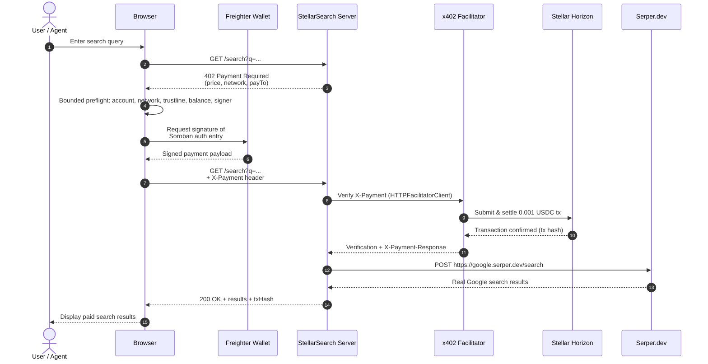

# 🔍 StellarSearch — Pay-Per-Query Web Search for AI Agents

[](https://github.com/Emmy123222/Stellar-Search/actions/workflows/ci.yml)

> **Stellar Hackathon 2026 · Agents on Stellar**
> Zero mock data. Real x402 payments. Real Serper.dev Search. Real Groq AI. Real Freighter wallet.

---

## What it is

StellarSearch is a pay-per-query web search API for autonomous AI agents. Every search costs **0.001 USDC**, settled on Stellar in ~5 seconds using the x402 protocol. No subscriptions, no API keys for the end user — agents pay per request and get real web search results back.

---

## Real stack (no mocks)

| Layer            | Real package / service                              |
| ---------------- | --------------------------------------------------- |
| Payment protocol | `@x402/express` + `@x402/stellar` + `@x402/core`    |
| Blockchain       | Stellar Testnet (via Horizon API)                   |
| Facilitator      | OpenZeppelin x402 (`channels.openzeppelin.com`)     |
| Wallet connect   | `@stellar/freighter-api` (real Freighter extension) |
| Balances / tx    | Stellar Horizon REST API (live, not mocked)         |
| Search results   | Serper.dev API (real Google search results)         |
| AI assistant     | `groq-sdk` · Llama 3.3 70B (real Groq API)          |
| Frontend         | React 18, TypeScript, Tailwind CSS, Framer Motion   |

---

## Setup

### 1. Clone and install

```bash
git clone <this-repo>
cd stellar-search
npm install
```

### 2. Get your keys (all free)

| Key                         | Where to get it                                                                                               |
| --------------------------- | ------------------------------------------------------------------------------------------------------------- |
| `STELLAR_RECEIVING_ADDRESS` | [Stellar Lab](https://laboratory.stellar.org/#account-creator?network=test) — generate + fund testnet keypair |
| `SERPER_API_KEY`            | [serper.dev](https://serper.dev/) — free tier: 2.5k queries/month                                             |
| `GROQ_API_KEY`              | [console.groq.com/keys](https://console.groq.com/keys) — free                                                 |

### 3. Configure

```bash
cp .env.example .env
# Fill in the 3 keys above (plus optional variables — see Environment Variables table below)
```

### 4. Install Freighter

Install the [Freighter browser extension](https://freighter.app), create a testnet wallet, and fund it with USDC at [Stellar Lab](https://laboratory.stellar.org).

### 5. Run

```bash
# Terminal 1 — backend
npm run server

# Terminal 2 — frontend
npm run dev
# → http://localhost:5173
```

### 6. Test the x402 flow

```bash
# Discovery mode: health + runtime checks
npm run search:cli -- "Stellar x402" --mode discovery --json

# Quote mode: fetch the x402 quote without settling payment
npm run search:cli -- "Stellar x402" --mode quote --json --receipt ./tmp/quote.json

# Search mode: run the paid flow with a timeout and optional freshness filter
npm run search:cli -- "Stellar x402" --mode search --count 5 --timeout 30000 --freshness pw
```

The CLI supports `discovery`, `quote`, and `search` modes, emits machine-readable JSON when `--json` is used, and can write a receipt file with `--receipt path/to/file.json`. For paid actions, prefer secure environment variables or a protected prompt for signing material; never pass private keys on the command line or print them in logs.

---

## Environment Variables

All environment variables are read from a local `.env` (see the sanitized `.env.example` template). Variables prefixed with `VITE_` are exposed to the browser by Vite; all others are server-side only. Startup validates configuration before Express, Vercel paid routes, or MCP tools begin serving requests. Errors list only variable **names**, never values.

| Variable | Required | Default | Description | Example |
|---|---|---|---|---|
| `SERPER_API_KEY` | **Yes** | — | API key for [Serper.dev](https://serper.dev/) web search. Without this, all search, image, and news endpoints return `500`. | `your_serper_api_key_here` |
| `GROQ_API_KEY` | No | — | API key for [Groq](https://console.groq.com/keys) AI (Llama 3). When absent, search remains available and AI endpoints return `503`. | `gsk_xxxxxxxxxxxxxxxxxxxxxxxx` |
| `STELLAR_RECEIVING_ADDRESS` | **Yes** | — | Stellar public key that receives 0.001 USDC per query. Without this, the x402 payment middleware has no `payTo` address and payments fail. Server prints `Receiving: ✗ MISSING` on startup. | `GDXA3V2LI3VN3GBH5BMOF25QSFJV7S7ZOWMHHQMJRPP4BVORDDRTIIMU` |
| `STELLAR_NETWORK` | No | `stellar:testnet` | Stellar network for the server-side x402 middleware. Accepts `stellar:testnet` or `stellar:mainnet`. Falls back to testnet if missing. | `stellar:testnet` |
| `VITE_STELLAR_NETWORK` | No | `stellar:testnet` | Frontend copy of `STELLAR_NETWORK` (must be prefixed `VITE_` for browser access). Falls back to testnet if missing. | `stellar:testnet` |
| `FACILITATOR_URL` | No | `https://www.x402.org/facilitator` | x402 facilitator endpoint for payment settlement. Falls back to the public OpenZeppelin facilitator if missing. | `https://www.x402.org/facilitator` |
| `PORT` | No | `3001` | Express server listen port. Falls back to `3001` if missing. | `3001` |
| `TRUST_PROXY_HOPS` | No | `0` | Reverse-proxy hops to trust so the rate limiter resolves real client IPs (e.g. `1` for Vercel). `0`/unset disables trusting `X-Forwarded-For` (spoof-safe); `true` trusts all proxies. | `1` |
| `RATE_LIMIT_PER_MINUTE` | No | `30` | Positive request limit applied by Express. | `30` |
| `PAYMENT_AMOUNT_USDC` | No | `0.001` | Positive USDC amount. Must exactly equal `PAYMENT_AMOUNT_STROOPS / 10^7`. | `0.001` |
| `PAYMENT_AMOUNT_STROOPS` | No | `10000` | Positive Stellar stroop amount paired with `PAYMENT_AMOUNT_USDC`. | `10000` |
| `VITE_SERVER_URL` | No | `/api` | Browser-safe API base URL. Defaults to same-origin `/api`, which works for custom domains and subpaths; Vite proxies it to Express locally. | `/api` or `https://api.example.com/stellar` |
| `MCP_ENABLE_RECEIPTS` | No | `0` | Set `1` to opt-in MCP local receipt storage for `stellar-search://receipts/recent` (in-memory capped at 50) | `1` |

### Deployment configuration

Use your platform's encrypted secret configuration (for example, Vercel Project Settings → Environment Variables) for `STELLAR_RECEIVING_ADDRESS` and `SERPER_API_KEY`; do not commit production `.env` files. `.env.production`, `.env`, and local override files are ignored. Only `.env.example` is tracked and it contains placeholders only.

Before deploying locally, run:

```bash
npm run config:check
```

The typed schema checks required core variables separately from optional feature variables, plus Stellar network enums, public-key addresses, HTTP(S) URLs, ports, rate limits, and the USDC/stroop amount relationship. The browser receives only `VITE_STELLAR_NETWORK` and `VITE_SERVER_URL`; secrets never enter the browser configuration view.
| `VITE_SERVER_URL` | No | `http://localhost:3001` | Frontend URL for AI chat backend calls. On Vercel deployments auto-detects `${origin}/api`; locally falls back to `http://localhost:3001`. | `http://localhost:3001` |
| `MCP_ENABLE_RECEIPTS` | No | `0` | Set `1` to opt-in MCP local receipt storage for `stellar-search://receipts/recent` (in-memory capped at 50) | `1` |
| `RECONCILIATION_LOG_PATH` | No | `logs/reconciliation.jsonl` | Path to the append-only settlement reconciliation log (see [Settlement reconciliation](#settlement-reconciliation)). | `/var/log/stellarsearch/reconciliation.jsonl` |
| `SERPER_BREAKER_FAILURE_THRESHOLD` | No | `5` | Consecutive Serper failures (5xx/429/network error) required to open the circuit breaker (see [Serper circuit breaker](#serper-circuit-breaker-120)). | `5` |
| `SERPER_BREAKER_OPEN_MS` | No | `30000` | Milliseconds the breaker stays open before allowing a half-open recovery probe. | `30000` |
| `SERPER_BREAKER_HALF_OPEN_PROBES` | No | `1` | Concurrent requests allowed through while the breaker is half-open, testing recovery. | `1` |

> Startup validation: the server validates `STELLAR_NETWORK` and `STELLAR_RECEIVING_ADDRESS` before the paid routes are mounted. Invalid values fail fast with a clear error that redacts the actual address instead of logging secret material.

---

## x402 service discovery

Autonomous clients can fetch [`/.well-known/x402`](http://localhost:3001/.well-known/x402) without payment to discover the paid resources before making a request. Express and Vercel serve the same runtime-generated document; Vercel rewrites the stable root path to its serverless handler.

The document includes `resourceTemplates` for `/search`, `/images`, and `/news`, plus the active `networks`, Soroban USDC `assets`, supported payment `schemes`, and a `priceDiscoveryUrl`. Each template carries the exact x402 payment option, including the configured receiving address, network, asset, and `10000` stroop (`0.001 USDC`) price. The metadata is intentionally public and does not bypass payment, approval, signature verification, replay protection, or settlement on paid routes.

The response is cacheable for five minutes. Set `PUBLIC_BASE_URL` to keep `priceDiscoveryUrl` canonical behind a reverse proxy.

## How the x402 payment flow works

```
Browser (Freighter) → GET /search?q=...
                     ← HTTP 402 + payment requirements
                     → Preflight: account, network, trustline, balance, signer
                     → Sign Soroban auth entry (Freighter prompt)
                     → GET /search + X-Payment: <signature>
                     ← OpenZeppelin facilitator verifies + settles 0.001 USDC
                     ← 200 OK + Search results
```

Before signing, a bounded preflight verifies the active account, expected network, USDC trustline, spendable amount, and signer availability. If any check fails, no payment payload is created and the user gets a single targeted recovery action (e.g. "Add USDC", "Switch to testnet", or "Enable signer").

| Preflight check | Required state | Targeted recovery action |
|---|---|---|
| Active account | A Freighter account is selected | Connect Freighter and select an account |
| Expected network | Freighter network matches `VITE_STELLAR_NETWORK` (default `stellar:testnet`) | Switch Freighter to the configured Stellar network |
| USDC trustline | Trustline to the Soroban USDC contract exists | Add the USDC trustline in Freighter |
| Spendable amount | USDC balance ≥ 0.001 USDC (`AMOUNT_STROOPS=10000`) | Fund the wallet with testnet USDC |
| Signer availability | Freighter can sign Soroban authorization entries | Unlock Freighter and approve the request |

1. Agent hits `/search` — the `@x402/express` middleware intercepts
2. Returns `HTTP 402 Payment Required` with price + network + payTo address
3. After the preflight passes, the x402 client signs a Soroban authorization entry via Freighter wallet
4. Retries with `X-Payment` header containing the signed entry
5. OpenZeppelin facilitator at `channels.openzeppelin.com/x402/testnet` verifies the signature and settles 0.001 USDC on Stellar testnet
6. Server enforces payment integrity (`src/lib/paymentIntegrity.ts`), rejecting replayed or duplicate payloads within the 300-second validity window, and returns search results

### Payment Integrity & Replay Protection

To guarantee that each payment identifier authorizes **exactly one provider call**, StellarSearch tracks consumed payment identifiers across Express (`server/index.ts`) and Vercel (`api/search.ts`) runtimes:

- **Payload Invalidation:** Extracts transaction hashes (or SHA-256 fallback hashes of payment headers) and invalidates consumed payloads for a 300-second window.
- **Concurrency Throttling:** Rapid parallel requests using identical payment payloads are throttled so only one search query proceeds; concurrent duplicates immediately receive HTTP 402 (`Payment payload already consumed`).
- **Idempotency Keys:** Clients can send `Idempotency-Key` or `X-Idempotency-Key` together with a payer identifier and request params. Repeated in-flight or completed requests for the same logical search return the original response instead of triggering a second settlement.

Requests bound to the same payer and query parameters must reuse the same idempotency key. The server hashes the route, payer, supplied key, and normalized params to generate a stable idempotent entry, preserving x402 settlement semantics while preventing duplicate charges from browser or proxy retries.

### Serper circuit breaker (#120)

A sustained Serper.dev outage shouldn't let every incoming request hang on a
slow/failing upstream, consuming connection slots and retry budgets while an
agent has already committed to (or is about to commit to) a paid x402 flow.
`src/lib/serperClient.ts` wraps every direct Serper call — in Express
(`server/index.ts`: `/search`, `/images`, `/news`, batch JSONL, async jobs)
and in the Vercel functions (`api/search.ts`, `api/search/batch.ts`,
`api/jobs.ts`) — in a shared circuit breaker (`src/lib/circuitBreaker.ts`):

- **Closed** (normal): requests pass through. Consecutive 5xx/429 responses
  or network errors increment a failure counter; a single success resets it.
- **Open**: once `SERPER_BREAKER_FAILURE_THRESHOLD` consecutive failures are
  hit, the breaker opens. Further requests fail immediately with
  `503 Search provider temporarily unavailable` (+ a `Retry-After` header) —
  no network call is made — for `SERPER_BREAKER_OPEN_MS`.
- **Half-open**: after the open duration elapses, the next
  `SERPER_BREAKER_HALF_OPEN_PROBES` request(s) are let through as a probe. A
  successful probe closes the breaker; a failed one re-opens it immediately.

A **4xx** from Serper (e.g. a malformed query) does *not* count as a breaker
failure — Serper answered, so that's not a signal the dependency is down.

Breaker state is exposed on `GET /health` (Express) and `/api/health`
(Vercel) as `serperCircuitBreaker: { state, failureCount, failureThreshold,
openDurationMs, halfOpenMaxProbes, openedAt, nextAttemptAt }` for
monitoring/alerting. The browser and MCP server never call Serper directly —
they call these `/search`/`/images`/`/news` endpoints — so they inherit the
fast-fail behavior transitively without their own breaker.
### Client-side duplicate submission guard

The server-side throttling above assumes a request actually reaches it — but
`useSearch` (`src/hooks/useSearch.ts`) can itself be asked to start a second
paid flow before the first has settled, e.g. a double Enter/double click that
fires before React re-renders `isSearching`, or a second browser tab open on
the same page. To prevent that from producing two Freighter payment prompts
(and two settlements) for one logical query:

- **Same-tab guard:** a `useRef` flips synchronously on the first call and
  blocks re-entrant calls for the lifetime of that in-flight search,
  independent of React's (batched, async) `session.status` state.
- **Cross-tab mutex:** a `localStorage`-backed lock (`stellarsearch_search_lock`)
  is acquired before the 402 probe is even sent. A second tab attempting to
  search while the lock is held gets a toast ("Search already in progress")
  instead of starting its own payment flow. The lock carries a 20s TTL so a
  crashed/closed tab can never permanently block searching in other tabs.

Both guards release in a `finally` block regardless of success or failure, so
a completed or failed search always unblocks the next one.

### Method Handling & Allow Headers

Every endpoint explicitly handles `OPTIONS` (preflight) and returns `405 Method Not Allowed` with a correct `Allow` header for unsupported methods. This keeps Express, Vercel, browser, and MCP behaviour aligned:

| Endpoint | Allowed Methods |
|---|---|
| `GET /search` | `GET, OPTIONS` |
| `GET /images` | `GET, OPTIONS` |
| `GET /news` | `GET, OPTIONS` |
| `GET /health` | `GET, OPTIONS` |
| `POST /ai/chat` | `POST, OPTIONS` |
| `GET /` | `GET, OPTIONS` |

405 responses include a common error body: `{ "error": "Method not allowed" }`.

### Wallet & Horizon — Independent Resource Tracking

Connection, balance, and history are tracked as **independent resources** so a failure in one never erases valid data from the others (`src/hooks/useFreighterWallet.ts:27,268`):

- **Connection `connection: ResourceState`** (`src/hooks/useFreighterWallet.ts:268`) — `loading = wallet.loading`, `error = wallet.error`, `lastUpdated` set on successful `connect` (`src/hooks/useFreighterWallet.ts:186`). A connection error (e.g., `Freighter extension not found`) does not clear `balance` or `history` data/lastUpdated.
- **Balance `balance: ResourceState`** (`src/hooks/useFreighterWallet.ts:273`) — `loading/error/lastUpdated` wired to `horizon.loadAccount` (`src/hooks/useFreighterWallet.ts:74`). On success updates `wallet.xlmBalance/usdcBalance` and `balanceLastUpdated`; on error sets `balanceError` only and **preserves** previous balances. `refreshBalances` (`src/hooks/useFreighterWallet.ts:223`) touches only balance.
- **History `history: ResourceState`** (`src/hooks/useFreighterWallet.ts:278`) — `loading/error/lastUpdated` wired to `horizon.operations().forAccount` (`src/hooks/useFreighterWallet.ts:112`). On success updates `transactions` and `txLastUpdated`; on error sets `historyError` only and **preserves** previous transactions. `refreshHistory` (`src/hooks/useFreighterWallet.ts:229`) touches only history. `refresh` runs both via `Promise.allSettled` keeping errors isolated (`src/hooks/useFreighterWallet.ts:235`).

`WalletPanel.tsx:14,43` consumes `balance/history/connection` to show separate spinners, `Balance: ...`/`History: ...` error banners, and `Updated Xm ago` timestamps (via `formatTimeAgo`), with `Refresh balances` and `Refresh history` buttons that call `onRefreshBalances`/`onRefreshHistory` without cross-erasure. This keeps Express/Vercel/MCP (x402) and browser (Horizon) aligned — Horizon history remains browser-only and x402 settlement (`AMOUNT_STROOPS=10000` → `0.001 USDC`) is unchanged.

### Sequence diagram



### Settlement reconciliation

Every paid `/search`, `/images`, and `/news` request writes a
`ReconciliationRecord` (`src/lib/reconciliation.ts`) to an append-only JSON
Lines log (`server/reconciliationStore.ts`, default `logs/reconciliation.jsonl`,
configurable via `RECONCILIATION_LOG_PATH`). Each record links the request's
idempotency key (the payment identifier from `src/lib/paymentIntegrity.ts`),
its settlement receipt (tx hash), and whether a provider response was
delivered — **never the query text itself** — so operators can catch two
kinds of drift:

- `settled_no_delivery` — payment was consumed but no search response was
  delivered (upstream Serper error, a validation failure after the payment
  gate, etc.)
- `delivered_no_settlement` — a response was returned without a captured
  payment identifier (shouldn't happen given the x402 gate; catches
  regressions)

Run the repeatable reconciliation job to report unmatched or inconsistent
records (exits non-zero when any are found, so it can run on a schedule):

```bash
npm run reconcile:report
```

---

## Paid HTTP API — `/search`, `/images`, `/news`

Three paid HTTP endpoints are exposed by the Express server. Each one costs
`PAYMENT_AMOUNT_USDC` (default **0.001 USDC**, `10000` stroops) settled on
Stellar through x402, and each one is guarded by the same middleware chain:

```
parameter validation (400)  →  x402 payment challenge (402)  →  replay guard (402)  →  Serper  →  200
```

Validation runs **first**, so a malformed request is refused before a payment
challenge is ever issued and before any payment payload is consumed.

### Runtime availability

| Endpoint | Express (`npm run server`) | Vercel (`api/`) | MCP tool |
|---|:--:|:--:|---|
| `GET /search` | ✅ | ✅ `GET /api/search` | `web_search` |
| `GET /images` | ✅ | ❌ *not deployed* | `image_search` |
| `GET /news` | ✅ | ❌ *not deployed* | `news_search` |

> **Compatibility note:** `/images` and `/news` currently have **no Vercel
> serverless equivalent** — `api/` only implements `search`, `search/batch`,
> `jobs`, `jobs/[id]`, `ai/chat`, and `health`. Agents that need image or news
> search must target an Express deployment (or the MCP server, which proxies to
> one via `SEARCH_API_URL`). The MCP tools clamp `count` client-side before
> calling, so they never trip the 400s below.

### Parameters and limits

| Endpoint | `q` (required) | `count` | `freshness` |
|---|---|---|---|
| `GET /search` | 1–256 chars | integer `1..20`, default `5` | `pd` \| `pw` \| `pm` |
| `GET /images` | 1–256 chars | integer `1..10`, default `10` | **not supported** — ignored |
| `GET /news` | 1–256 chars | integer `1..20`, default `10` | `pd` \| `pw` \| `pm` |

- **`q`** — required. Trimmed; ASCII control characters and null bytes are
  stripped. Empty, missing, non-string, or longer than 256 characters → `400`.
  Must be URL-encoded (use `curl --data-urlencode`, see below).
- **`count`** — optional. Must be a *single* integer inside the route's bounds.
  Out-of-range (`0`, `-1`, `999`), non-integer (`abc`, `1.5`, `1e3`), and
  repeated params (`?count=1&count=2`) are **rejected with `400`** — they are
  *not* silently clamped. Forwarded to Serper as `num`.
- **`freshness`** — optional. Maps to the Serper `tbs` date filter:
  `pd` → `qdr:d` (past day), `pw` → `qdr:w` (past week), `pm` → `qdr:m` (past
  month). Any other value, or a repeated param, is **rejected with `400`**.
  `/images` has no date filter, so `freshness` is accepted-and-ignored there
  rather than rejected.
- **Rate limit** — `RATE_LIMIT_PER_MINUTE` (default `30`) per IP across all
  routes; `429` with `Retry-After: 60` once exceeded.

Bounds and enums live in `src/lib/paramValidation.ts` and are shared by every
paid route on both runtimes — see
[Parameter validation on paid endpoints (#188)](#parameter-validation-on-paid-endpoints-188).

### Error responses

| Status | Body | When |
|---|---|---|
| `400` | `{"error":"Missing required parameter: q"}` | `q` absent or blank |
| `400` | `{"error":"Query too long. Maximum 256 characters."}` | `q` over 256 chars |
| `400` | `{"error":"count must be between 1 and 10"}` | `/images?count=999` |
| `400` | `{"error":"count must be an integer"}` | `?count=1.5` |
| `400` | `{"error":"count must be a single value"}` | `?count=1&count=2` |
| `400` | `{"error":"freshness must be one of: pd, pw, pm"}` | `?freshness=yesterday` |
| `402` | `{}` + `PAYMENT-REQUIRED` header | no payment presented |
| `402` | `{"error":"Payment payload already consumed"}` | payment header replayed |
| `429` | `{"error":"Too many requests, please try again later."}` | rate limited |
| `502` | `{"error":"Serper.dev API error: <status>"}` | upstream Serper failure |
| `500` | `{"error":"Image search failed. Check server logs."}` | unexpected server error |

### Step 1 — the 402 challenge

An unpaid request returns **`402` with an empty JSON body**. The challenge
itself travels in the base64-encoded **`PAYMENT-REQUIRED` response header**
(x402 v2), which is listed in `Access-Control-Expose-Headers` so browser
clients can read it cross-origin.

```bash
curl -i --get \
  --data-urlencode 'q=stellar lumens' \
  http://localhost:3001/images
```

```http
HTTP/1.1 402 Payment Required
Content-Type: application/json; charset=utf-8
Access-Control-Expose-Headers: PAYMENT-REQUIRED,X-Payment-Response
PAYMENT-REQUIRED: eyJ4NDAyVmVyc2lvbiI6MiwiZXJyb3IiOiJQYXltZW50IHJlcXVpcmVkIiwi...

{}
```

Decode it with:

```bash
curl -sD - -o /dev/null --get \
  --data-urlencode 'q=stellar lumens' \
  http://localhost:3001/images \
  | grep -i '^payment-required:' | cut -d' ' -f2 \
  | tr -d '\r' | base64 -d | jq .
```

```jsonc
{
  "x402Version": 2,
  "error": "Payment required",
  "resource": {
    "url": "http://localhost:3001/images?q=stellar%20lumens",
    "description": "StellarSearch: pay-per-query image search — 0.001 USDC on Stellar",
    "mimeType": ""
  },
  "accepts": [
    {
      "scheme": "exact",
      "network": "stellar:testnet",
      "amount": "10000",                                          // stroops, not dollars
      "asset": "CBIELTK6YBZJU5UP2WWQEUCYKLPU6AUNZ2BQ4WWFEIE3USCIHMXQDAMA", // Soroban USDC contract
      "payTo": "G...",                                            // STELLAR_RECEIVING_ADDRESS
      "maxTimeoutSeconds": 300,
      "extra": { "areFeesSponsored": true }
    }
  ]
}
```

`/news` returns the identical structure with a `news search` description.
`asset` is always a Soroban **`C...` contract address**, never `USDC:ISSUER`.

### Step 2 — pay and retry

Sign the Soroban authorization entry from `accepts[0]` (Freighter in the
browser, `@x402/fetch` for agents) and replay the request with the signed
payload. The server accepts the payload on any of these request headers:

| Header | Notes |
|---|---|
| `PAYMENT-SIGNATURE` | x402 **v2** — what `@x402/fetch` sends by default |
| `X-PAYMENT` | x402 **v1** compatibility |
| `Authorization` | accepted by the replay guard for legacy clients |

The facilitator's settlement receipt comes back on the **`X-PAYMENT-RESPONSE`**
response header, and the server echoes it into the JSON body as `txHash`.

Each payload is single-use: replaying one within its validity window returns
`402 {"error":"Payment payload already consumed"}` (see
[Payment Integrity & Replay Protection](#payment-integrity--replay-protection)).

In practice you do not hand-roll this — use the x402 client:

```bash
# Quote the challenge without settling, then run the full paid flow
npm run search:cli -- "stellar lumens" --mode quote --json
npm run search:cli -- "stellar lumens" --mode search
```

### Step 3 — the paid response

#### `GET /images`

```bash
curl -s --get \
  --data-urlencode 'q=stellar lumens' \
  --data-urlencode 'count=1' \
  -H "PAYMENT-SIGNATURE: $SIGNED_PAYLOAD" \
  http://localhost:3001/images | jq .
```

```json
{
  "query": "stellar lumens",
  "results": [
    {
      "id": "1",
      "title": "Stellar Lumens logo",
      "imageUrl": "https://cdn.example.com/xlm.png",
      "thumbnailUrl": "https://cdn.example.com/xlm-thumb.png",
      "sourceUrl": "https://example.com/xlm",
      "source": "example.com",
      "width": 1200,
      "height": 630
    }
  ],
  "count": 1,
  "network": "stellar:testnet",
  "paidAmount": "0.001",
  "currency": "USDC",
  "txHash": "e3b0c44298fc1c149afbf4c8996fb92427ae41e4649b934ca495991b7852b855",
  "latencyMs": 412
}
```

#### `GET /news`

```bash
curl -s --get \
  --data-urlencode 'q=stellar lumens' \
  --data-urlencode 'count=1' \
  --data-urlencode 'freshness=pw' \
  -H "PAYMENT-SIGNATURE: $SIGNED_PAYLOAD" \
  http://localhost:3001/news | jq .
```

```json
{
  "query": "stellar lumens",
  "results": [
    {
      "id": "1",
      "title": "Stellar network upgrade ships",
      "url": "https://news.example.com/a",
      "snippet": "Protocol 23 went live...",
      "source": "Example News",
      "publishedAt": "2 hours ago",
      "imageUrl": "https://news.example.com/a.jpg"
    }
  ],
  "count": 1,
  "network": "stellar:testnet",
  "paidAmount": "0.001",
  "currency": "USDC",
  "txHash": "e3b0c44298fc1c149afbf4c8996fb92427ae41e4649b934ca495991b7852b855",
  "latencyMs": 388
}
```

### Result fields

Envelope fields shared by `/search`, `/images`, and `/news`
(`SearchResponse` / `ImageSearchResponse` / `NewsSearchResponse` in
`src/types/index.ts`):

| Field | Type | Description |
|---|---|---|
| `query` | `string` | The sanitized query actually sent upstream |
| `results` | `array` | Normalized rows — see the per-endpoint tables below |
| `count` | `number` | `results.length` **after** normalization, so it can be lower than the requested `count` |
| `network` | `string` | `stellar:testnet` or `stellar:mainnet` |
| `paidAmount` | `string` | USDC settled for this request, e.g. `"0.001"` |
| `currency` | `string` | Always `"USDC"` |
| `txHash` | `string \| null` | Settlement tx from `X-PAYMENT-RESPONSE`; `null` if the facilitator sent none |
| `latencyMs` | `number` | Upstream Serper round-trip, excluding payment settlement |

`/search` additionally returns `originalQuery`, `executedQuery`,
`suggestedQuery`, `isCorrected`, and `suggestions` — see
[Spelling-Correction Metadata](#spelling-correction-metadata--user-confirmation-302).

**`ImageResult`** — rows without a valid `http(s)` `imageUrl` are dropped by
`normalizeImageResults`:

| Field | Type | Description |
|---|---|---|
| `id` | `string` | 1-based index within this response |
| `title` | `string` | Image title, or `"No title"` |
| `imageUrl` | `string` | Full-resolution image URL (validated `http(s)`) |
| `thumbnailUrl` | `string` | Thumbnail URL; falls back to `imageUrl` |
| `sourceUrl` | `string` | Page hosting the image; falls back to `imageUrl` |
| `source` | `string` | Source domain |
| `width` / `height` | `number?` | Pixel dimensions when Serper reports them |

**`NewsResult`** — rows without a valid `http(s)` `link` are dropped by
`normalizeNewsResults`:

| Field | Type | Description |
|---|---|---|
| `id` | `string` | 1-based index within this response |
| `title` | `string` | Headline, or `"No title"` |
| `url` | `string` | Article URL (validated `http(s)`) |
| `snippet` | `string` | Article excerpt; `""` when absent |
| `source` | `string` | Publication name; falls back to the URL hostname |
| `publishedAt` | `string?` | Relative age as reported by Serper, e.g. `"2 hours ago"` |
| `imageUrl` | `string?` | Article thumbnail when present |

### Settlement guarantees

Every paid `/search`, `/images`, and `/news` request appends a
`ReconciliationRecord` linking the payment identifier, the settlement tx hash,
and whether results were delivered — never the query text. See
[Settlement reconciliation](#settlement-reconciliation).

---

## Project structure

Four runtimes share one set of contracts. Anything under `src/lib/` is
**shared** — imported by the browser bundle, the Express server, the Vercel
functions, and the MCP server alike — so a change there must keep all four
aligned. Everything else is runtime-specific.

```
stellar-search/
├── src/                              # SHARED types/logic + React frontend (browser)
│   ├── lib/                          # ── shared by browser, Express, Vercel, MCP ──
│   │   ├── config.ts                 # Typed env parsing: server / browser / MCP views
│   │   ├── constants.ts              # STELLAR_NETWORK, USDC_CONTRACT, AMOUNT_STROOPS
│   │   ├── paramValidation.ts        # count/freshness contract for every paid route (#188)
│   │   ├── paymentIntegrity.ts       # x402 payload identity + single-use replay guard
│   │   ├── reconciliation.ts         # ReconciliationRecord builder + drift classification
│   │   ├── serverHealth.ts           # /health stats contract: what each runtime measures (#226)
│   │   ├── serperNormalizer.ts       # Serper → SearchResult / ImageResult / NewsResult
│   │   ├── receiptBundle.ts          # Signed receipt bundle export + integrity proofs
│   │   ├── hashing.ts                # Hash helpers for receipts/proofs
│   │   ├── aiChatService.ts          # Groq chat client (browser-side)
│   │   ├── onboarding.ts             # First-run onboarding state (#342)
│   │   └── stellar.ts                # Horizon/explorer helpers (browser-facing)
│   ├── types/index.ts                # SHARED response, batch JSONL, and job contracts
│   ├── components/
│   │   ├── search/                   # SearchBar, SearchResults, ImageResults, NewsResults,
│   │   │                             # ModeSelector, SearchSuggestions, SavedResearchPanel,
│   │   │                             # SpellingCorrectionBanner, PaymentFlowVisualizer
│   │   ├── wallet/WalletPanel.tsx    # Freighter connect + live Horizon balances
│   │   ├── layout/                   # Navbar, Footer, AnimatedBackground, LiveTicker
│   │   ├── ai/GroqAssistant.tsx      # Groq AI chat panel
│   │   ├── onboarding/               # OnboardingFlow (#342)
│   │   └── ui/                       # StatsGrid (health-contract aware), ZeroBalanceBanner
│   ├── hooks/                        # useSearch, useFreighterWallet, useSavedResearch,
│   │                                 # usePageVisible
│   ├── pages/                        # SearchPage, DocsPage, DashboardPage
│   └── i18n/                         # i18next setup + locales/en/*.json (#345)
│
├── server/                           # EXPRESS runtime (the only one serving /images, /news)
│   ├── index.ts                      # App + x402 middleware, paid-route param validation,
│   │                                 # /search /images /news /search/batch /jobs /health /ai/chat
│   ├── corsConfig.ts                 # Allow-list CORS options shared by all Express routes
│   ├── logger.ts                     # Winston JSON logger
│   └── reconciliationStore.ts        # Append-only JSONL settlement log
│
├── api/                              # VERCEL serverless runtime (no /images or /news — see
│   │                                 # "Runtime availability" under Paid HTTP API)
│   ├── index.ts                      # Service descriptor for GET /api
│   ├── search.ts                     # Vercel parity for GET /search
│   ├── search/batch.ts               # Vercel parity for POST /search/batch (JSONL)
│   ├── jobs.ts                       # POST /jobs + GET /jobs list
│   ├── jobs/[id].ts                  # GET /jobs/:id status + verified payment
│   ├── ai/chat.ts                    # Groq AI chat (free)
│   └── health.ts                     # Health: config facts + declared stats gap (#226)
│
├── mcp-server/index.ts               # MCP runtime: web_search, image_search, news_search,
│                                     # ai_summarize, check_balance, get_search_stats
│                                     # + resources, prompts, progress notifications
│
├── scripts/
│   ├── test-search.ts                # CLI: discovery / quote / search modes (+ receipts)
│   ├── check-config.ts               # `npm run config:check` env validation
│   ├── reconcile-report.ts           # `npm run reconcile:report` settlement drift report
│   ├── smoke.mjs                     # Non-secret preview smoke suite (dependency-free)
│   ├── verify-sbom.mjs               # CI: assert the CycloneDX SBOM is well-formed
│   ├── check-vulnerabilities.mjs     # CI: HIGH/CRITICAL dependency gate
│   └── setup.sh                      # `npm run setup`
│
├── .github/workflows/
│   ├── ci.yml                        # Typecheck, lint, test, coverage gate, supply chain
│   └── preview-smoke.yml             # Smoke-tests the Vercel Preview URL on every PR
│
├── vercel.json                       # Serverless routing, SPA rewrites, CORS headers
├── vite.config.ts                    # Vite build, dev proxy → Express, coverage thresholds
├── tsconfig*.json                    # Per-runtime TS projects: base / node / server / api /
│                                     # mcp / scripts
├── .env.example                      # Placeholders only — never real secrets
├── claude_mcp.json                   # Claude Desktop / Claude Code MCP registration
└── README.md
```

Tests live beside the code they cover as `*.test.ts` / `*.test.tsx`, so each
runtime's suite stays with that runtime:

| Scope | Notable suites |
|---|---|
| Shared (`src/lib/`) | `paramValidation`, `paymentIntegrity`, `serperNormalizer`, `reconciliation`, `receiptBundle`, `serverHealth`, `config`, `constants`, `hashing`, `onboarding`, `stellar` |
| Express (`server/`) | `parameterMatrix` (all paid routes), `payment`, `validateQuery`, `corsConfig`, `health`, `reconciliationStore`, `reconciliation.integration` |
| Vercel (`api/`) | `search`, `search/batch`, `jobs`, `jobs/[id]`, `ai/chat`, `health` |
| MCP (`mcp-server/`) | `tools`, `clampCount` |
| Browser (`src/`) | `SearchPage`, `DocsPage`, `SearchBar`, `SpellingCorrectionBanner`, `ZeroBalanceBanner`, `StatsGrid`, `useSearch`, `useFreighterWallet`, `usePageVisible`, `i18n` |
| Scripts | `scripts/test-search.test.ts`, `scripts/smoke.test.ts` |

---

## Internationalization (#345)

English is the complete, always-available fallback locale, via [i18next](https://www.i18next.com) + `react-i18next`. Setup lives in `src/i18n/`:

- **Namespaces**, one JSON file per feature area under `src/i18n/locales/en/`: `common` (nav/footer), `wallet`, `search`, `onboarding`, `errors`, `docs`.
- **Eager vs. lazy**: `common` is bundled at build time; `wallet`/`search`/`onboarding`/`errors` are loaded once at boot (`main.tsx`) since they're needed for the always-visible chrome. `docs` is genuinely lazy — `loadNamespace('docs')` is only called when `DocsPage` mounts, so its translations ship in their own chunk rather than the main bundle.
- **Pluralization**: standard i18next `_one`/`_other` key suffixes, e.g. `wallet:queriesRemaining`.
- **Interpolation**: e.g. `common:footer.links.explorer` (`"{{network}} Explorer"`), and payment-unit amounts like `onboarding:steps.payment.description` (`"...settles {{amount}} USDC..."`).
- **Adding a namespace**: add it to `SUPPORTED_NAMESPACES` in `src/i18n/index.ts`, add `src/i18n/locales/en/<name>.json`, then either add it to `main.tsx`'s eager-load list or call `loadNamespace('<name>')` from whichever component needs it.

**Scope note**: this introduces the framework and converts a representative slice of the app's copy (nav, footer, wallet panel, onboarding, part of search, error messages from the wallet hook) — not literally every string in every component. `DocsPage`'s body copy and the rest of `SearchPage` remain hardcoded English for now; the pattern above is what to follow to convert them. Tests: `src/i18n/index.test.ts`.

## First-run onboarding (#342)

`src/components/onboarding/OnboardingFlow.tsx` walks a new user through the three things a paid search needs — connect Freighter, establish a USDC trustline, fund it — auto-opening once per browser (`localStorage`, key `stellar-search:onboarding-dismissed`) unless already dismissed or already fully set up, and reopenable anytime via the "?" button in the navbar.

- **Detection** (`src/lib/onboarding.ts`) is derived entirely from wallet state `useFreighterWallet` already exposes (`connected`, the new `hasUsdcTrustline` flag, `usdcBalance`) — nothing here reads or stores a secret key.
- **Testnet vs. mainnet** are visually distinguished in the modal (a banner plus separate funding links — Stellar Laboratory's testnet account creator vs. Circle for real USDC), reusing the same `IS_MAINNET` split `WalletPanel` already used for its own funding link.
- No new transaction-signing code was added — trustline setup and funding are point-and-click via Freighter/external tools, so the existing x402 payment/signing path (`useSearch`) is untouched. Tests: `src/lib/onboarding.test.ts`.

---

## Claude Code / MCP integration

```json
// claude_mcp.json
{
  "mcpServers": {
    "stellar-search": {
      "command": "npx",
      "args": ["tsx", "./mcp-server/index.ts"],
      "env": {
        "GROQ_API_KEY": "your_groq_api_key",
        "SEARCH_API_URL": "http://localhost:3001"
      }
    }
  }
}
```

Then tell Claude Code: `"Search for the latest Stellar x402 examples"` — it calls `web_search`, the server pays via x402, and Claude gets real results.### MCP progress notifications (#327)

Paid MCP tools (`web_search`, `image_search`, `news_search`) emit **bounded** `notifications/progress` events for actual payment/search phases **only when the client sends `_meta.progressToken`**:

| progress | total | phase | message |
|---:|---:|---|---|
| 1 | 4 | challenge | Requesting payment challenge |
| 2 | 4 | signing | Signing Soroban auth |
| 3 | 4 | settlement | Settling 0.001 USDC on Stellar |
| 4 | 4 | search | Searching Serper |

Cancellation (`notifications/cancelled`) and errors terminate progress cleanly **without false completion** — the tool returns `isError: true` and no additional progress after abort. Progress is never sent without a `progressToken`; free tools never emit progress.

### MCP timeouts & cancellation propagation (#170)

Every external network call the MCP server makes — StellarSearch endpoints, Horizon, `/health`, and Groq — receives an **`AbortSignal` with a tool-specific deadline** (see `TOOL_TIMEOUTS` in `mcp-server/index.ts`):

| Tool | Deadline |
|---|---:|
| `web_search`, `image_search`, `news_search`, `ai_summarize` | 30 s |
| `check_balance` (Horizon) | 15 s |
| `get_search_stats` (`/health`) | 10 s |

The deadline signal aborts when **either** the deadline elapses **or** the client cancels the tool call (`notifications/cancelled`), so a hung or cancelled request returns promptly with `isError: true` (`timed out` / `cancelled`) and **never** emits a delayed success result, receipt, or stray progress. Deadlines are released (`clear()`) on completion so successful calls never abort late.

### MCP resources & prompts (#326)

Resources (no payment required):

- `stellar-search://capabilities` — network, price, x402 scheme, endpoint map
- `stellar-search://schema/search` — JSON schema for `SearchResponse`, batch JSONL events, and job contracts
- `stellar-search://receipts/recent` — recent paid receipts **only when opted-in** (`MCP_ENABLE_RECEIPTS=1`, capped at 50, in-memory, no secrets). Otherwise returns guidance to opt-in.

Prompts (no silent payment):

- `research_brief` — proposes 3–5 queries, **asks for explicit user approval** before calling any paid `web_search`, then synthesizes via `ai_summarize`
- `summarize_results` — free Groq summarization of pasted results
- `compare_sources` — free comparison with citations

Prompts never call paid tools themselves; the agent must obtain user approval before initiating `x402` settlement. This preserves explicit user approval and verified settlement for paid actions.

### Batch JSON Lines streaming (#325)

```
POST /search/batch  (Express: POST /search/batch, Vercel: POST /api/search/batch)
Content-Type: application/json  →  Response: application/x-ndjson (versioned JSONL)
```

Bounded to **10 queries** and **0.01 USDC aggregate** (10 × 0.001). Idempotency via `Idempotency-Key` header or `body.idempotencyKey` (24 h). Events are `v:1` versioned:

- `quote` — price preview (also returned as 402 `PAYMENT-REQUIRED` when no `X-Payment` header)
- `settlement` — verified `paymentId`/`txHash` after `consumePaymentPayload`
- `result` — per-query normalized results (one line per query, machine-readable)
- `error` — per-item failures without aborting the batch (`UPSTREAM_ERROR`, `SEARCH_FAILED`, `CLIENT_DISCONNECT`, `SKIPPED`)
- `done` — aggregate `succeeded`/`failed`/`totalUsdcSpent`/`aggregateLatencyMs`

Disconnect aborts the in-flight Serper fetch via `AbortController`, emits `CLIENT_DISCONNECT`/`SKIPPED` errors for remaining items, and ends without a false `done` `succeeded` count. Partial completion is explicit in `done`. Example:

```bash
curl -N -X POST http://localhost:3001/search/batch \
  -H "Content-Type: application/json" \
  -H "X-Payment: <base64-signed-auth>" \
  -H "Idempotency-Key: my-batch-123" \
  -d '{"queries":["stellar x402","serper.dev"],"count":5}'
# each line is JSON: {"v":1,"type":"result",...}
```

### Async paid search jobs with webhooks (#324)


```
POST /jobs  → 202 { jobId, statusUrl, paymentVerified, paymentId, txHash }
GET  /jobs/:id → { job, paymentVerified, statusUrl }
GET  /jobs     → { jobs, count }
```

- Idempotent creation via `Idempotency-Key` (24 h, returns existing `jobId`/`statusUrl` on replay).
- Payment verified via `x402` header + `consumePaymentPayload` replay protection; `GET /jobs/:id` exposes verified payment state (`paymentVerified`, `txHash`, `paidAmount`).
- Optional webhook: `{ webhookUrl, webhookSecret }` — `webhookSecret` ≥16 chars. Delivery is **signed** (`X-Webhook-Signature: HMAC-SHA256(timestamp.payload)`, `X-Webhook-Timestamp`, `X-Webhook-Attempt`, `X-Job-Id`) and **retries with backoff** (5 attempts, `1s·2^n` + jitter, 5 s timeout, non-retryable 4xx except 429). Protects against replay via `timestamp` (5 min window) + `nonce`, and **SSRF** by rejecting `http`, private IPs (`10/8`, `192.168/16`, `172.16/12`, `169.254/16`, `fc00::/7`, `fe80::/10`, `localhost`, `127.0.0.1`, `0.0.0.0`, `::1`) and URLs with credentials.

```bash
curl -X POST http://localhost:3001/jobs \
  -H "Content-Type: application/json" \
  -H "X-Payment: <base64>" \
  -H "Idempotency-Key: job-123" \
  -d '{"query":"stellar x402","webhookUrl":"https://example.com/hook","webhookSecret":"s3cr3t-16-chars-min"}'
# → {"jobId":"...","statusUrl":"http://localhost:3001/jobs/...","paymentVerified":true}
curl http://localhost:3001/jobs/<jobId>
```

Webhook verification (receiver):

```js
import crypto from 'crypto'
function verify(payload, signature, secret, tsHeader) {
  const expected = crypto.createHmac('sha256', secret).update(`${tsHeader}.${payload}`).digest('hex')
  return crypto.timingSafeEqual(Buffer.from(expected), Buffer.from(signature)) && Date.now() - parseInt(tsHeader) < 5*60*1000
}
```

Express/Vercel/browser/MCP contracts stay aligned: `STELLAR_NETWORK`, `USDC_CONTRACT`, `AMOUNT_STROOPS=10000` (0.001 USDC), and verified settlement remain the single source of truth (`src/lib/constants`).

### Spelling-Correction Metadata & User Confirmation (#302)

When upstream search providers auto-correct or suggest queries ("Did you mean?"), callers and users can distinguish the query variations:

- `originalQuery` — user/caller input query
- `executedQuery` — actual query executed against the upstream search engine
- `suggestedQuery` — spelling suggestion / "Did you mean" query text
- `isCorrected` — boolean (`true` if `executedQuery` differs from `originalQuery`)
- `query` — preserved for backwards compatibility (maps to executed query)

**User Confirmation Mechanics:**
- **Auto-Correction**: Displays an informative banner explaining that results were auto-corrected, with a one-click option to search the original query with explicit wallet confirmation.
- **Did You Mean Suggestions**: Displays the suggested correction alongside "Search Suggestion" (which invokes the explicit Freighter confirmation flow) and a "Dismiss" action that closes the suggestion with **0 additional cost and no second payment**.
- No automatic or silent payments are ever executed.

### Search focus management (#150)

After an asynchronous search settles, keyboard and screen-reader focus moves to a **results heading** on success and to the **error alert** (`role="alert"`) on failure — so assistive tech users land directly on the outcome instead of the now-disabled search input.

- Focus moves **only** on the async completion transition (`searching` → `complete` / `error`), never while typing, signing, or during manual navigation.
- The results heading (`h2`, `tabIndex=-1`) is focusable and is rendered even for a successful search with zero results, so focus always has a destination.
- The error alert is focusable (`tabIndex=-1`) with `role="alert"` so failures are announced and reachable.

See `src/pages/SearchPage.tsx` (error focus) and `src/components/search/SearchResults.tsx` (results heading focus), covered by `src/pages/SearchPage.test.tsx`.

---

## Testing & Coverage

Coverage is enforced via **Vitest + @vitest/coverage-v8** with thresholds for **statements, branches, functions, and lines** (see `vite.config.ts:6`).

```bash
npm run test              # unit tests without coverage
npm run test:coverage     # run with coverage + thresholds (CI gate)
```

Reports are generated to `coverage/` (`text`, `json`, `html`, `lcov`). CI uploads the `coverage/` artifact and fails if thresholds are not met.

### Parameter validation on paid endpoints (#188)

All paid routes (`GET /search`, `GET /images`, `GET /news`, `POST /search/batch`, `POST /jobs`, and `GET /api/search`) share one validation contract via `src/lib/paramValidation.ts`:

- **`count`** — omitted → route default (`5` search/batch/jobs, `10` images/news); must be a single integer within the route bounds (`1..20` search/news/batch/jobs, `1..10` images). `0`, negatives, values above the max, non-integers (`abc`, `1.5`, `1e3`), and repeated params (`?count=1&count=2`) are **rejected early with 400**. Valid values are forwarded to Serper as `num`.
- **`freshness`** — must be one of `pd` (past day), `pw` (past week), `pm` (past month); omitted is allowed. Anything else (or repeated params) is **rejected early with 400**. Valid values map to Serper `tbs`: `qdr:d`, `qdr:w`, `qdr:m`. (`/images` does not support freshness.)
- **Early rejection** — validation runs **before** payment verification and the Serper call, so invalid input never invokes the downstream payment adapter (`consumePaymentPayload`) or the Serper adapter. Proven by the shared matrix in `server/parameterMatrix.test.ts` (all Express paid routes) and `api/search.test.ts` (Vercel `/api/search`): every reject case asserts HTTP 400 (not 402 — payment was never consulted), no `fetch`, and no payment-payload consumption, even when a payment header is present.

### Current thresholds (ratchet upward)

Global thresholds are deliberately modest initially and ratchet upward as payment/wallet/API/MCP/UI tests land:

| Scope | Statements | Branches | Functions | Lines |
|---|---:|---:|---:|---:|
| **Global** | 40% | 35% | 30% | 40% |
| `src/lib/constants.ts` | 90% | 60% | 100% | 90% |
| `src/lib/stellar.ts` | 85% | 75% | 85% | 85% |
| `src/lib/paymentIntegrity.ts` | 90% | 85% | 95% | 90% |
| `src/lib/serperNormalizer.ts` | 95% | 90% | 100% | 95% |
| `src/lib/paramValidation.ts` | 95% | 90% | 100% | 95% |
| `src/lib/serverHealth.ts` | 95% | 90% | 100% | 95% |
| `server/corsConfig.ts` | 90% | 85% | 95% | 90% |
| `src/components/search/SearchBar.tsx` | 80% | 80% | 90% | 80% |
| `src/components/search/SpellingCorrectionBanner.tsx` | 85% | 90% | 70% | 85% |
| `src/components/ui/StatsGrid.tsx` | 90% | 90% | 100% | 95% |
| `src/pages/SearchPage.tsx` | 65% | 65% | 70% | 75% |
| `src/pages/DashboardPage.tsx` | 70% | 55% | 55% | 75% |
| `src/lib/spendingLimits.ts` | 90% | 75% | 95% | 90% |
| `src/hooks/useSpendingLimits.ts` | 90% | 80% | 95% | 90% |
| `server/index.ts` | 30% | 24% | 25% | 35% |
| `api/search.ts` | 90% | 75% | 80% | 90% |
| `api/search/batch.ts` | 60% | 50% | 45% | 65% |
| `api/jobs.ts` | 45% | 30% | 30% | 55% |
| `api/jobs/[id].ts` | 95% | 90% | 100% | 95% |
| `api/health.ts` | 80% | 50% | 100% | 80% |
| `api/ai/chat.ts` | 90% | 60% | 60% | 90% |
| `mcp-server/index.ts` | 20% | 10% | 10% | 20% |
| `src/hooks/useFreighterWallet.ts` | 85% | 65% | 90% | 85% |
| `src/hooks/useSearch.ts` | 85% | 65% | 90% | 85% |

> **Ratchet policy:** When a module's real coverage exceeds its threshold, bump the threshold in `vite.config.ts` in the same PR. Global thresholds ratchet `15 → 25 → 35` as payment, wallet, API, MCP, and UI behavior moves from untested to tested. Keep Express (`server/`), Vercel (`api/`), browser (`src/`), and MCP (`mcp-server/`) constants aligned (`STELLAR_NETWORK`, `USDC_CONTRACT`, `AMOUNT_STROOPS=10000` → `0.001 USDC`).

Coverage verifies the **x402 settlement semantics** for paid routes (`/search`, `/images`, `/news`): `scheme=exact`, `network=stellar:testnet|mainnet`, `amount=10000 stroops`, `asset=C...` (Soroban USDC contract, not `USDC:ISSUER`), `payTo=G...`. See `server/index.ts:104`, `api/search.ts:48`, and `mcp-server/index.ts:19`.

Coverage also verifies the **bounded preflight guard** in `src/hooks/useFreighterWallet.ts` and `src/hooks/useSearch.ts`: if account, network, USDC trustline, spendable amount, or signer availability fails, the search surfaces one targeted recovery action and never creates a payment payload.

---

## Health and statistics (`/health`)

`/health` reports two different kinds of thing, and they must not be confused:

- **Configuration facts** — network, price, facilitator, which keys are set.
  Every runtime knows these and reports them.
- **Activity statistics** — `totalQueries`, `totalUsdcSettled`, `avgLatencyMs`,
  `uptime`. Only a runtime that actually measures them can report them.

Express keeps those counters in the same process that serves the paid routes,
so it measures all four. A Vercel function cannot: it is stateless, scales to
zero, and each request may land on a fresh instance, so an in-memory counter
there would describe one warm instance rather than the deployment.

Previously the serverless handler simply omitted the four fields, the browser
coalesced them (`data.totalQueries ?? 0`), and a Vercel deployment rendered
**"0 queries · $0.00 settled · 0ms"** beside a live green **SERVER ONLINE**
pulse. Those were not measurements — they were missing data presented as fact.
The MCP `get_search_stats` tool had it worse: `stats.totalQueries.toLocaleString()`
threw a `TypeError` on the absent field and surfaced as a misleading
`Failed to fetch server stats`.

### Every runtime declares what it measures

`src/lib/serverHealth.ts` holds the shared contract. Each `/health` response
now carries a declaration:

| Field | Type | Meaning |
|---|---|---|
| `statsSupported` | `boolean` | Whether this runtime measures the activity statistics |
| `unsupportedFields` | `string[]` | Which of `totalQueries`, `totalUsdcSettled`, `avgLatencyMs`, `uptime` it does not measure — empty when `statsSupported` is `true` |
| `statsUnavailableReason` | `string?` | Human-readable explanation; present only when something is unsupported |

**Express** (`GET /health`) — measures everything:

```jsonc
{
  "status": "ok",
  "network": "stellar:testnet",
  "pricePerQuery": "0.001 USDC",
  "protocol": "x402",
  "totalQueries": 12,
  "totalUsdcSettled": "0.0120",
  "avgLatencyMs": 384,
  "uptime": "7m",
  "statsSupported": true,
  "unsupportedFields": []
}
```

**Vercel** (`GET /api/health`) — configuration only, gap declared:

```jsonc
{
  "status": "ok",
  "network": "stellar:testnet",
  "pricePerQuery": "0.001 USDC",
  "protocol": "x402",
  "timestamp": "2026-09-02T12:00:00.000Z",
  "statsSupported": false,
  "unsupportedFields": ["totalQueries", "totalUsdcSettled", "avgLatencyMs", "uptime"],
  "statsUnavailableReason": "Serverless functions are stateless and scale to zero, so per-instance counters would reset on every cold start instead of reporting deployment activity. Run the Express server (npm run server) for live counters."
}
```

The counters are **omitted, not zeroed**. A field declared unsupported must
carry no value at all — the preview smoke suite fails a deployment that leaves
a stale one behind.

### Reading the statistics

Consumers call `resolveStat(health, field)` instead of reading the field
directly. It returns either `{ available: true, value }` or
`{ available: false, reason }`, which keeps the three states apart:

| State | `resolveStat` | UI |
|---|---|---|
| Measured, non-zero | `{ available: true, value: 1234 }` | `1,234` with the live pulse |
| **Measured, genuinely zero** | `{ available: true, value: 0 }` | `0` with the live pulse |
| **Not measured** | `{ available: false, reason }` | `n/a`, dimmed, no pulse, reason on hover |
| Server unreachable | `{ available: false, reason }` | `n/a`, `SERVER OFFLINE` |

The second and third rows are the distinction that matters: a freshly started
Express server that has served no queries **really has** served no queries, and
that is worth showing. A serverless deployment that never counted anything is
not the same claim.

`resolveStat` also tolerates a deployment predating this contract: present
values are trusted, absent ones are reported as undeclared rather than assumed
to be zero. An explicit declaration always wins over a stale value in the
payload.

### Behavior per consumer

- **Browser** (`src/components/ui/StatsGrid.tsx`) — unmeasured cards render
  `n/a`, dimmed, without the pulsing "live" dot, with the reason as a `title`
  and as screen-reader text. One panel-level note explains the whole grid when
  nothing is measured. The server still reads **ONLINE**, because it is.
- **MCP** (`get_search_stats`) — unmeasured values print as `not reported`
  followed by a single `⚠️` line with the reason, instead of throwing.
- **Preview smoke** (`scripts/smoke.mjs`) — the `/api/health` check fails a
  deployment that omits the counters without declaring them, that declares
  support but omits the values, or that declares a field unsupported while
  still reporting it.

### Migration notes

- **Additive and backward-compatible.** No existing field changed type or
  meaning; `statsSupported`, `unsupportedFields`, and `statsUnavailableReason`
  are new. Older clients that read `totalQueries` directly still work against
  Express and see the same behavior as before against Vercel.
- **If you add a runtime**, spread `declareStatsSupported()` or
  `declareStatsUnsupported(reason)` into its `/health` body. The smoke suite
  fails an undeclared deployment, so the gap cannot ship silently.
- **If you add durable serverless counters** (Vercel KV, Redis, or similar),
  switch `api/health.ts` to `declareStatsSupported()` and report the real
  values. Nothing downstream needs to change — the UI and MCP already render
  whatever is declared available.
- **No effect on paid routes.** This contract covers reporting only; the x402
  settlement path and its verified semantics are untouched.

---

## Preview deployment smoke tests

Unit tests cannot see a deployment. Serverless routing, CORS, environment
wiring, static assets, and the SPA rewrite only exist once Vercel has built a
Preview — so every pull request runs a smoke suite against its own Preview URL
before it can merge.

- **Suite:** `scripts/smoke.mjs` (12 checks)
- **Workflow:** `.github/workflows/preview-smoke.yml` — job name **`Preview smoke tests`**
- **Routing config under test:** `vercel.json`

### What it checks

| # | Check | Endpoint | Expected | Catches |
|---|---|---|---|---|
| 1 | SPA shell | `GET /` | `200` `text/html` with `#root` | broken build output / `outputDirectory` |
| 2 | Static asset | `GET /favicon.svg` | `200` `image/svg+xml` | assets not published |
| 3 | SPA rewrite | `GET /docs` | `200` `text/html` | missing `rewrites` in `vercel.json` |
| 4 | Service descriptor | `GET /api` | `200` JSON, `name: StellarSearch` | serverless routing not wired |
| 5 | Environment wiring + stats declaration | `GET /api/health` | `200`, `status: ok`, `protocol: x402`, and a valid `statsSupported` declaration | missing `STELLAR_RECEIVING_ADDRESS` / `SERPER_API_KEY`; counters omitted without being declared (see [Health and statistics](#health-and-statistics-health)) |
| 6 | CORS preflight | `OPTIONS /api/search` | `200`/`204` allowing `payment-signature` + `x-payment` | browser clients unable to send the signed payload |
| 7 | Method guard | `POST /api/search` | `405` | handler-level regressions |
| 8 | Missing `q` | `GET /api/search` | `400` | validation not reached |
| 9 | `count` out of bounds | `GET /api/search?count=999` | `400` **not** `402` | validation running after the payment gate |
| 10 | Repeated `count` | `?count=1&count=2` | `400` | array coercion regressions |
| 11 | Unknown `freshness` | `?freshness=yesterday` | `400` | enum drift |
| 12 | **x402 challenge** | `GET /api/search?q=…` | `402` + valid `PAYMENT-REQUIRED` | settlement-semantics drift (see below) |

Check 12 decodes the base64 `PAYMENT-REQUIRED` header and asserts the
**verified x402 settlement semantics** that a bad deploy silently breaks:
`scheme=exact`, `network=stellar:testnet|stellar:mainnet`, an **integer stroop**
`amount` (never a decimal dollar figure), an `asset` that is a Soroban `C…`
contract address (never `USDC:ISSUER`), a `payTo` Stellar `G…` address, and a
positive `maxTimeoutSeconds`. It also asserts `PAYMENT-REQUIRED` is listed in
`Access-Control-Expose-Headers`, without which a browser client cannot read the
challenge at all.

### Non-secret by construction

The suite needs **no repository secrets, no Vercel token, no wallet, and no
signing material**, and it **never settles a payment** — the x402 checks stop at
the 402 challenge, so a run costs **0 USDC**. It is also dependency-free plain
ESM, so CI runs it straight from a checkout without `npm ci`.

Response artifacts are header-filtered before they are written: `authorization`,
`set-cookie`, `x-api-key`, and the payment headers are never captured, and
bodies are truncated to 2 KB.

### Failure reporting

A failing run fails the check and reports the **exact endpoint** three ways:

1. a `::error::` annotation per failed endpoint in the PR checks UI, titled
   `METHOD /path (status)`;
2. a Markdown report in the job summary naming each failed endpoint, the status
   received versus expected, and a collapsible **response artifact** (filtered
   headers + truncated body);
3. an uploaded `preview-smoke-results` artifact (14-day retention) containing
   `smoke-results.json` and `smoke-report.md`.

```
✗ 2 of 12 checks failed:
  GET https://preview.vercel.app/docs → 404 (expected 200)
      deep link was not rewritten to index.html — got "text/plain". Check the "rewrites" block in vercel.json.
  GET https://preview.vercel.app/api/health → 500 (expected 200)
      health did not return JSON — a 500 here usually means required env vars
      (STELLAR_RECEIVING_ADDRESS, SERPER_API_KEY) are not set on this deployment
```

### Running it yourself

```bash
# Against any deployment (a bare host is assumed to be https)
node scripts/smoke.mjs https://your-preview.vercel.app

# Capture artifacts locally
node scripts/smoke.mjs my-preview.vercel.app \
  --json smoke-artifacts/smoke-results.json \
  --markdown smoke-artifacts/smoke-report.md
```

Exit code is `0` when all checks pass and `1` otherwise.

### Wiring it up

1. Connect the repository to Vercel so Preview deployments are created for pull
   requests. The workflow triggers on GitHub's `deployment_status` event, which
   Vercel's integration emits with the Preview URL — **no Vercel token needed**.
2. In **Settings → Branches → Branch protection rules** for `main`, add
   **`Preview smoke tests`** to the required status checks.
3. Set `STELLAR_RECEIVING_ADDRESS` and `SERPER_API_KEY` for the **Preview**
   environment in Vercel Project Settings, or check 5 will fail by design.

To smoke-test a URL by hand, run the workflow from **Actions → Preview smoke →
Run workflow** and paste the deployment URL.

### `vercel.json`

The routing config the suite validates:

- `rewrites` — everything except `/api/*` falls through to `/index.html` so the
  SPA renders on a deep link.
- `headers` — CORS for `/api/*`, allowing the `payment-signature` / `x-payment`
  request headers and **exposing** `PAYMENT-REQUIRED`, `PAYMENT-RESPONSE`, and
  `X-Payment-Response` so browser clients can complete the x402 flow;
  `Cache-Control: no-store` so a paid response is never cached.
- `functions` — `maxDuration: 30` for `api/**/*.ts`, enough for the JSONL batch
  stream and async job routes.

> **Runtime boundary:** the Preview only exercises the **Vercel** runtime, which
> serves `/api/search`, `/api/search/batch`, `/api/jobs`, `/api/jobs/:id`,
> `/api/ai/chat`, and `/api/health`. `/images` and `/news` are **Express-only**
> and are covered by `server/parameterMatrix.test.ts` instead — see
> [Runtime availability](#runtime-availability).

---

## Supply chain security & SBOM

The `supply-chain` CI job generates a **CycloneDX SBOM** from the committed lockfile and runs a **dependency vulnerability gate** using [OSV-Scanner](https://google.github.io/osv-scanner/).

### SBOM

- The SBOM is generated deterministically from `package-lock.json` (no `node_modules` required):

  ```bash
  npm run sbom          # writes ./sbom.cyclonedx.json
  node scripts/verify-sbom.mjs   # validates it's a non-empty CycloneDX doc
  ```

- CI uploads the SBOM as the **`cyclonedx-sbom`** artifact (`sbom.cyclonedx.json`).

### Vulnerability gate (fail/exception policy)

- OSV-Scanner runs with `--config=osv-scanner.toml` (repo root). That file is the single source of truth for the exception policy.
- The pipeline **fails** when OSV-Scanner reports a **High or Critical** vulnerability that is **not** covered by a documented exception.
- **Low / Moderate** findings are reported only and do not block.
- Exceptions are **time-boxed**: each `[[IgnoredVulns]]` entry sets an `ignoreUntil` deadline and a `reason`, so an accepted risk re-flags CI for triage when it lapses.

> See `CONTRIBUTING.md` → **Supply-Chain Security** for the full policy and how to add an exception.

---

## Hackathon requirements

| Requirement                       | ✓                                                                                |
| --------------------------------- | -------------------------------------------------------------------------------- |
| Open-source repo + README         | ✅                                                                               |
| 2–3 min video demo                | Record showing: connect Freighter → search → see 402 → payment settles → results |
| Real Stellar testnet transactions | ✅ Every search settles 0.001 USDC via OpenZeppelin facilitator                  |
| x402 protocol                     | ✅ `@x402/express` + `@x402/stellar`                                             |
| Addresses explicit demand signal  | ✅ "pay-per-query web search instead of monthly subscriptions"                   |
