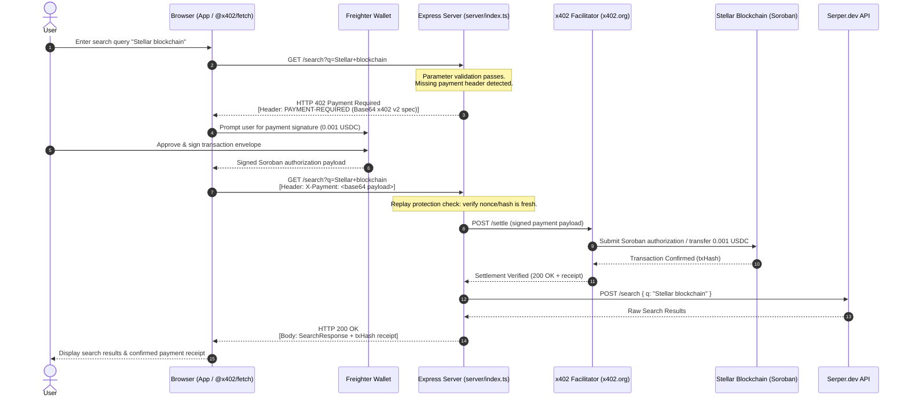
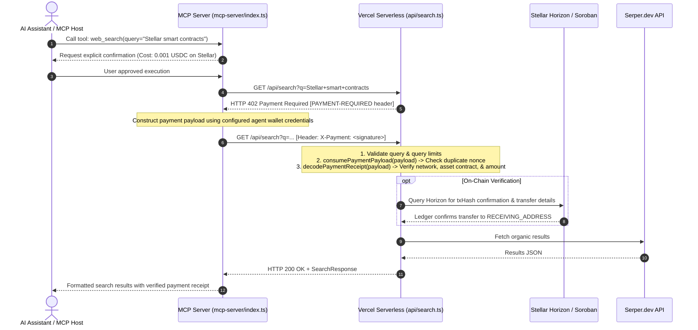

# ADR 001: x402 Payment Verification and Cross-Runtime Parity

- **Status:** Accepted
- **Date:** 2026-09-26
- **Authors:** StellarSearch Core Architecture
- **Deciders:** Engineering Team & Protocol Architecture
- **Consulted:** Express Server, Vercel Serverless, MCP Server, Browser Frontend Teams

---

## 1. Context and Problem Statement

StellarSearch is a pay-per-query web search platform utilizing the **x402 payment protocol** on the Stellar blockchain (USDC on Soroban testnet/mainnet). The platform operates across multiple runtime environments:

1. **Long-running Node.js / Express server** (`server/index.ts`) for Docker containers, local development, batch queries (`/search/batch`), and async jobs (`/jobs`).
2. **Serverless Vercel Node functions** (`api/search.ts`) for hosted edge and serverless HTTP API deployments.
3. **Model Context Protocol (MCP) server** (`mcp-server/index.ts`) enabling autonomous AI agents (Claude, Cursor, etc.) to query search tools with user-approved on-chain payments.
4. **Browser SPA client** (`src/`) interfacing with the Freighter wallet extension and `@x402/fetch`.

### The Problem

Historically, payment verification mechanisms evolved independently between Express and Vercel:

- **Express** relied on `@x402/express` (`paymentMiddlewareFromConfig`) delegating verification and settlement directly to an external HTTP facilitator (`HTTPFacilitatorClient` at `FACILITATOR_URL`).
- **Vercel** serverless functions parsed raw incoming payment headers (`payment-signature`, `x-payment`, `X-PAYMENT`), performed local replay protection checks (`consumePaymentPayload`), and decoded receipts via custom verification (`decodePaymentReceipt`).

Without a durable architectural decision record, discrepancies in trust boundaries, replay protection, timeout semantics, and cryptographic validation risk diverging, potentially causing inconsistent user experiences or security loopholes across runtimes.

---

## 2. Decision Drivers

- **Security & Trust Boundaries:** Ensure cryptographically sound payment verification before upstream search provider queries (Serper.dev) are dispatched.
- **Settlement Semantics:** Guarantee that users are charged exactly once per query (or per batch query) and never charged for invalid/rejected requests.
- **Cross-Runtime Consistency:** Express, Vercel, MCP, and Browser must agree on payment schemes (`exact`), networks (`stellar:testnet` / `stellar:mainnet`), assets (Soroban USDC contract address `C...`), stroop amounts (`10000` = `0.001` USDC), and replay protections.
- **Latency & Reliability:** Maintain low overhead for interactive search while supporting graceful error recovery and circuit breaking against external failure.
- **Developer & Agent Usability:** Maintain clean machine-readable x402 discovery (`/.well-known/x402`) and MCP resource schemas (`stellar-search://capabilities`).

---

## 3. Architecture & Trust Boundaries

```
+---------------------------------------------------------------------------------------+
|                                    CLIENT BOUNDARY                                    |
|                                                                                       |
|   +--------------------------+                         +--------------------------+   |
|   |   Browser Application    |                         |     AI Agent / Client    |   |
|   |     (React + Vite)       |                         |    (Claude Desktop / IDE)|   |
|   +------------+-------------+                         +------------+-------------+   |
|                |                                                    |                 |
|                v                                                    v                 |
|   +--------------------------+                         +--------------------------+   |
|   | Freighter Wallet Adapter |                         |      MCP Server Tool     |   |
|   |  (@stellar/freighter-api)|                         |   (mcp-server/index.ts)  |   |
|   +------------+-------------+                         +------------+-------------+   |
+----------------|----------------------------------------------------|-----------------+
                 |                                                    |
                 | HTTP Request (GET /search?q=...)                   | HTTP / Tool RPC
                 | [Headers: X-Payment / payment-signature]           |
                 v                                                    v
+---------------------------------------------------------------------------------------+
|                                  API RUNTIME BOUNDARY                                 |
|                                                                                       |
|   +------------------------------------+   +--------------------------------------+   |
|   |         Express Container          |   |          Vercel Serverless           |   |
|   |         (server/index.ts)          |   |           (api/search.ts)            |   |
|   +-----------------+------------------+   +-------------------+------------------+   |
|                     |                                          |                      |
|       Parameter & Sanitization Validation        Parameter & Sanitization Validation  |
|                     |                                          |                      |
|       In-Memory & Shared Replay Defense          Bounded Consumption Replay Defense   |
|         (recentReceipts / nonce window)          (consumePaymentPayload / nonce store)|
|                     |                                          |                      |
|             @x402/express                              x402 V2 Header Parser          |
|       (paymentMiddlewareFromConfig)              (decodePaymentReceipt / verify)      |
+---------------------|------------------------------------------|----------------------+
                      |                                          |
                      | Verify & Settle Signed Authorization     | Verify & Decode Ledger
                      v                                          v
+---------------------------------------------------------------------------------------+
|                                EXTERNAL PROTOCOL BOUNDARY                             |
|                                                                                       |
|   +------------------------------------+   +--------------------------------------+   |
|   |          x402 Facilitator          |   |         Stellar Network Node         |   |
|   |     (https://www.x402.org)         |   |         (Horizon / Soroban)          |   |
|   +-----------------+------------------+   +-------------------+------------------+   |
|                     |                                          ^                      |
|                     +------------ Settle On-Chain -------------+                      |
+---------------------------------------------------------------------------------------+
                                          |
                        Valid Settlement Confirmed (HTTP 200)
                                          |
                                          v
+---------------------------------------------------------------------------------------+
|                                UPSTREAM PROVIDER BOUNDARY                             |
|                                                                                       |
|                           +-----------------------------+                             |
|                           |   Serper.dev Search Engine  |                             |
|                           |     (Google Search API)     |                             |
|                           +--------------+--------------+                             |
|                                          |                                            |
|                                 Organic Search Data                                   |
|                                          v                                            |
|                           +-----------------------------+                             |
|                           |      Client Application     |                             |
|                           +-----------------------------+                             |
+---------------------------------------------------------------------------------------+
```

---

## 4. Sequence Diagrams

### 4.1. Browser & Express Search Flow via x402 Facilitator



### 4.2. MCP Agent & Serverless Verification Flow



---

## 5. Decision & Invariants

1. **Pre-Payment Parameter Validation Gate:**
   - Both Express and Vercel **must validate request parameters (`q`, `count`, `freshness`, `locale`, etc.) before demanding or evaluating payment**.
   - If a request is malformed (e.g., query too long or count out of range), the server returns `HTTP 400 Bad Request` without emitting a `402 Payment Required` or consuming payment credentials. The user is never charged for invalid requests.

2. **Unified Specification & Asset Identification:**
   - Assets must always be specified by their Soroban contract address (`CBIELTK6YBZJU5UP2WWQEUCYKLPU6AUNZ2BQ4WWFEIE3USCIHMXQDAMA` on testnet, `CCW67TSZV3SSS2HXMBQ5JFGCKJNXKZM7UQUWUZPUTHXSTZLEO7EJJUST` on mainnet), **not** the legacy classic `USDC:ISSUER` string.
   - Amounts in payment requirement challenges are communicated in integer stroops (`10000` = `0.001` USDC) using 7 decimal places standard to Stellar assets.

3. **Replay Protection Invariant:**
   - All runtime adapters must pass payments through cryptographic nonce and timestamp consumption before dispatching requests to Serper.
   - Payloads are checked against a bounded time window (aligned with `maxTimeoutSeconds: 300`) and cached memory stores (`consumePaymentPayload` and Express replay middlewares).

4. **Receipt Decoding and Audit Trails:**
   - Both Express and Vercel produce matching receipt schemas (`SearchReceipt`):
     - `id`: unique receipt identifier.
     - `txHash`: 64-character hexadecimal transaction hash (or `null` if pending/omitted).
     - `network`: `stellar:testnet` or `stellar:mainnet`.
     - `amount`: stringified payment amount (`0.001`).
     - `currency`: `USDC`.
     - `timestamp`: ISO-8601 UTC timestamp.
   - Receipts are stored in bounded, privacy-safe circular in-memory stores (`recentReceipts` in Express, `mcpReceipts` in MCP when opted in) with no secrets or private keys recorded.

5. **Upstream Circuit Breaker & Graceful Degrade:**
   - Serper.dev calls are protected by an in-memory circuit breaker (`serperClient.ts` / `serperCircuitBreaker.ts`). If upstream services degrade, requests fail fast with `HTTP 503` before taking payment, or error handling records failed status cleanly.

---

## 6. Alternatives Considered

### Alternative A: Full Direct Horizon Verification in Every Serverless Invocation

- _Description:_ Every Vercel serverless request independently queries Horizon before invoking Serper.
- _Pros:_ Completely eliminates trust in facilitators.
- _Cons:_ Adds 400ms–1200ms latency to every search query and risks hitting Horizon public rate limits.
- _Decision:_ Retain facilitator-driven instant verification with fallback to Horizon receipt verification (`receiptVerification.ts`) for post-facto audit and dispute resolution.

### Alternative B: Restrict Payments to Express Only (Drop Vercel x402)

- _Description:_ Direct all paid search traffic solely through the Express Docker container; treat Vercel as a frontend-only host.
- _Pros:_ Single runtime for payment verification.
- _Cons:_ Sacrifices serverless scalability, low global edge latency, and multi-region deployment flexibility.
- _Decision:_ Maintain cross-runtime parity with shared verification rules in `src/lib/paymentIntegrity.ts` and `src/lib/constants.ts`.

---

## 7. Migration & Parity Alignment Plan

1. **Phase 1: Shared Core Modules (Complete):**
   - Centralize network identifiers, contract addresses, and payment constants in `src/lib/constants.ts`.
   - Centralize receipt decoding and replay consumption in `src/lib/paymentIntegrity.ts`.
2. **Phase 2: Architectural Documentation (Current):**
   - Publish ADR 001 documenting boundaries, sequence flows, and invariant rules.
3. **Phase 3: Shared Verification Middleware (Planned):**
   - Refactor Express and Vercel payment handling to utilize a shared headless verifier module that wraps `@x402/core` with uniform error structures and logging.
4. **Phase 4: Automated Cross-Runtime Conformance Tests:**
   - Maintain end-to-end and integration tests verifying identical 402 challenge payloads, replay rejection, and parameter precedence across Express (`server/payment.test.ts`) and Vercel (`api/search.test.ts`).

---

## 8. Consequences

### Positive

- Predictable and auditable payment settlement behavior across Express, Vercel, and MCP.
- Clear trust model for contributors and external security researchers.
- Zero double-spending risks through documented and enforced replay defense layers.

### Negative / Trade-offs

- Maintaining dual runtime support requires keeping integration test coverage updated across both serverless handlers and long-running Express processes.
